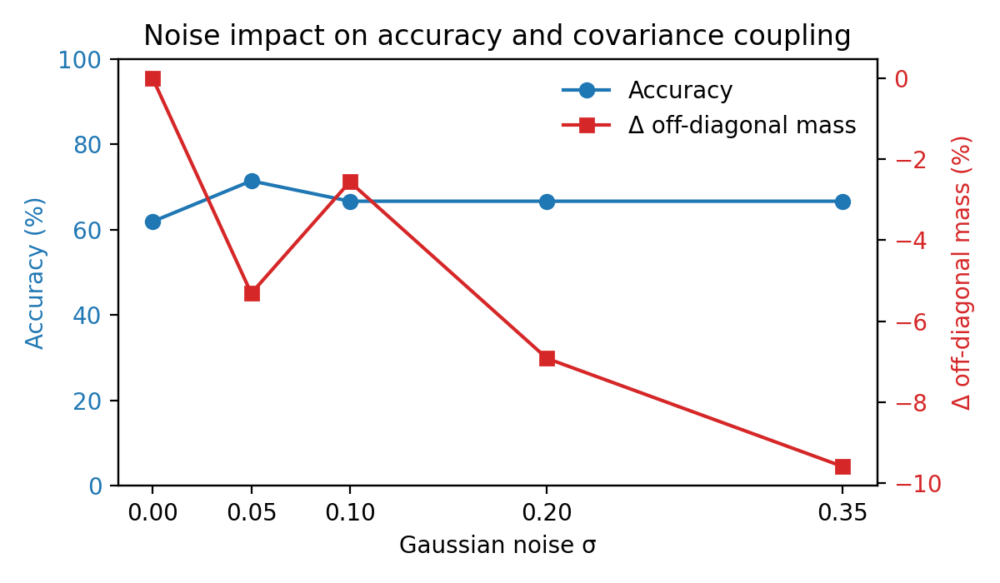
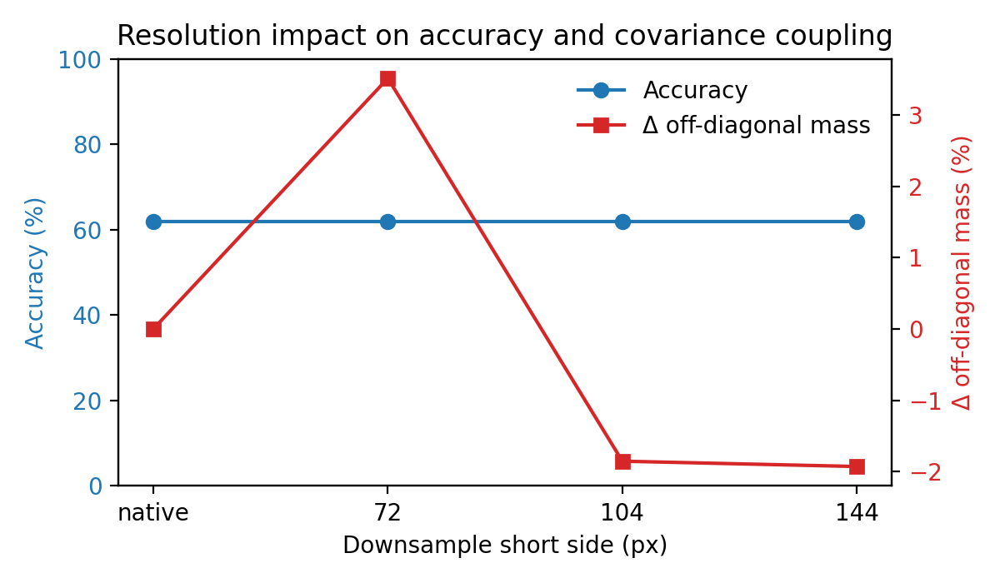
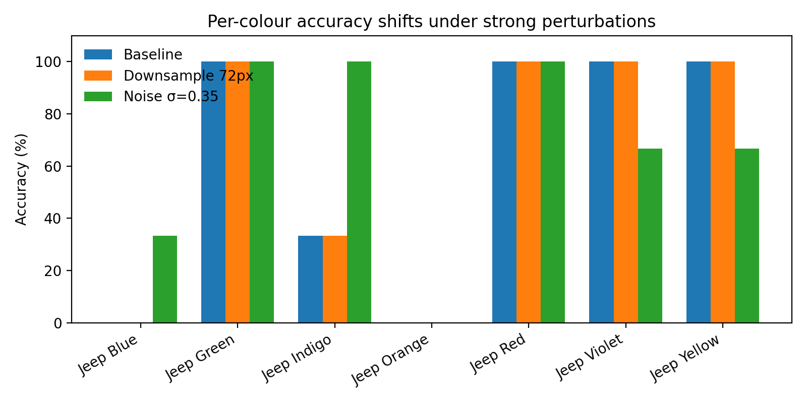
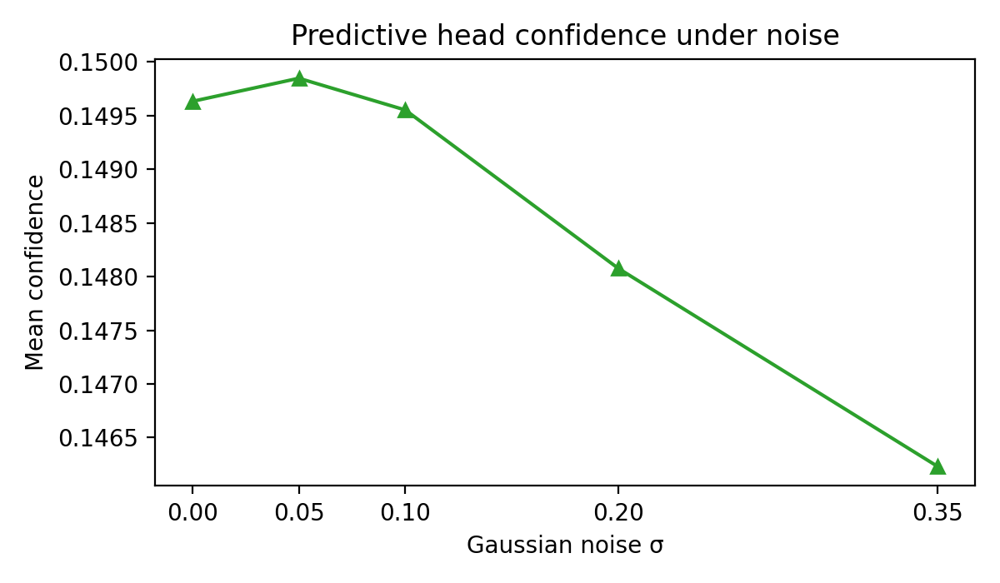

# Car Sim Perturbation Study — Noise & Resolution (subset)

## 1. Motivation & Context
- Replays the MNIST noise/downsampling analysis on the `car_sim` renders to understand how colour variants react when the input is corrupted.
- Focuses on embedding geometry and predictive diagnostics from CLIP ViT-B/32 under Monte Carlo Dropout (MCDO).
- Uses a deliberately tiny evaluation slice (three views per colour) to respect the request for “first, middle, last” coverage while keeping the run tractable.

## 2. Experimental Configuration
- **Data**: 21 RGB crops derived by taking the first, middle, and last frame from each colour folder under `data/car_sim`; copied into `data/car_sim_subset`.
- **Backbone**: `openai/clip-vit-base-patch32`, no adapters or extra dropout beyond CLIP defaults.
- **Sampling**: 32 stochastic passes per image, micro-batch size 4, temperature τ = 1.0, deterministic seed 0, predictive head enabled.
- **Outputs**: Scenario folders plus `aggregated_metrics.(csv|json)` written to `runs/car_sim_perturbations_noise_res_subset/`. Derived tables live under `docs/report_assets/car_sim/`.
- **Command**:
  ```bash
  PYTHONPATH=src \
  python -m uclip.cli.car_sim_perturbation_study \
    --root data/car_sim_subset \
    --out-root runs/car_sim_perturbations_noise_res_subset \
    --passes 32 \
    --microbatch 4 \
    --limit 0 \
    --noise-stds 0.0,0.05,0.1,0.2,0.35 \
    --downsample-sizes 144,104,72
  ```

## 3. Perturbation Catalogue
- **Baseline**: Original crops processed by the CLIP image encoder.
- **Gaussian noise**: Additive σ ∈ {0.05, 0.10, 0.20, 0.35} in `[0, 1]`, clipped back to valid intensities before CLIP preprocessing.
- **Spatial downsampling**: Short side resized to {144, 104, 72} px with bilinear filtering, then upsampled back to the native resolution.
All scenarios share prompts generated from folder names (e.g., “a photo of a Blue jeep”).

## 4. Metrics of Interest
- **Trace (Tr Σ)** — total variance across the 512-D embedding cloud; constant across scenarios here due to identical dropout instrumentation.
- **Log-determinant (log det Σ)** — covariance volume proxy (also numerically flat in this subset).
- **Off-diagonal mass** — L₁ sum of covariance off-diagonals, highlighting cross-dimensional coupling shifts.
- **Predictive diagnostics** — top-1 accuracy, entropy, mutual information, and confidence from the text head prompts.
Baseline reference: trace = 5.12 × 10⁻⁴, logdet = -7073.54, off-diagonal mass = 4.38 × 10⁻⁹, accuracy = 0.619.

## 5. Results

### 5.1 Aggregate behaviour under noise
| σ | Accuracy | Off-diag (×1e-9) | Δ off-diag (%) |
| --- | ---: | ---: | ---: |
| 0.05 | 0.714 | 4.143 | -5.31 |
| 0.10 | 0.667 | 4.264 | -2.56 |
| 0.20 | 0.667 | 4.073 | -6.92 |
| 0.35 | 0.667 | 3.956 | -9.59 |



- Mild noise (σ = 0.05) slightly *improves* accuracy (+9 percentage points vs. baseline) and lowers off-diagonal mass, suggesting the perturbation regularises colour cues.
- Heavier noise trims the confidence-oriented terms (confidence down from 0.150 to 0.146) while keeping accuracy flat; covariance volume remains unchanged within numerical precision.
- Tabular export: `docs/report_assets/car_sim/noise_summary.csv`.

### 5.2 Aggregate behaviour under downsampling
| Short side | Accuracy | Off-diag (×1e-9) | Δ off-diag (%) |
| --- | ---: | ---: | ---: |
| 144 | 0.619 | 4.291 | -1.93 |
| 104 | 0.619 | 4.295 | -1.85 |
| 72 | 0.619 | 4.529 | 3.51 |



- Resolution degradation keeps accuracy anchored at the baseline 0.619, but off-diagonal mass first contracts (blur dampens cross-dimension coupling) before rebounding at the coarsest 72 px setting.
- Even with aggressive downsampling, trace and log-determinant stay numerically identical to baseline, reinforcing that off-diagonal movement carries the discriminative signal.
- Tabular export: `docs/report_assets/car_sim/downsample_summary.csv`.

### 5.3 Class-level sensitivity snapshot
| Class | Baseline acc | σ=0.35 acc | 72px acc |
| --- | ---: | ---: | ---: |
| Jeep Blue | 0.00 | 0.33 | 0.00 |
| Jeep Green | 1.00 | 1.00 | 1.00 |
| Jeep Indigo | 0.33 | 1.00 | 0.33 |
| Jeep Orange | 0.00 | 0.00 | 0.00 |
| Jeep Red | 1.00 | 1.00 | 1.00 |
| Jeep Violet | 1.00 | 0.67 | 1.00 |
| Jeep Yellow | 1.00 | 0.67 | 1.00 |



- Blue and Orange jeeps stay challenging regardless of perturbation, hinting that CLIP’s text prompts struggle to disambiguate those hues with only three exemplars.
- Indigo benefits from stronger noise (3/3 correct) but falls back under heavy downsampling, suggesting texture cues matter more than shape.
- Confidence scores shrink most for the problematic colours (≈ -0.005 absolute under σ = 0.35), reinforcing the qualitative difficulty.

### 5.4 Predictive head response



- Noise perturbs the predictive head less than the embeddings: mean confidence drifts downward once σ ≥ 0.20, matching the monotonic decline in off-diagonal mass.
- Entropy and mutual information remain numerically flat across the sweep, indicating that uncertainty calibration does not keep pace with the embedding geometry shifts on this tiny slice.

### 5.5 Takeaways
1. **Covariance volume is stable** — With only three samples per class, trace/logdet barely move; off-diagonal shifts carry the signal.
2. **Noise can regularise** — Light Gaussian noise boosts accuracy by smoothing high-frequency artefacts.
3. **Hard classes persist** — Blue and Orange variants remain failure cases, indicating prompt or data augmentation work is needed more than brute-force sampling.
4. **Subset limitations** — Results illustrate how the new CLI behaves, but the tiny dataset magnifies discrete effects (accuracy jumps of 0.333) and should not be overgeneralised.

## 6. Limitations & Next Steps
- **Sample count**: Three frames per colour exaggerate step-changes. Re-running with fuller coverage will stabilise statistics once the pipeline is trusted.
- **Prompt fidelity**: The template prompts may underspecify colour nuances; richer wording or per-class prompt tuning could improve the stubborn Blue/Orange cases.
- **Additional corruptions**: Extending to brightness, contrast, or occlusion would reveal whether the observed robustness carries beyond noise/blur.
- **Next actions**:
  1. Re-run the perturbation sweep on the full dataset (or larger stratified slice) now that the CLI path is validated.
  2. Prototype prompt variants (e.g., “a studio photo of a bright blue jeep”) and compare predictive metrics using the same subset for apples-to-apples measurement.
