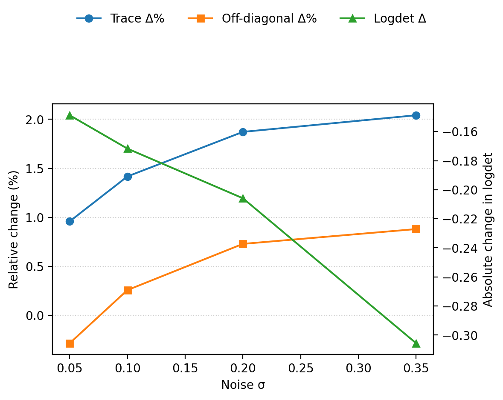
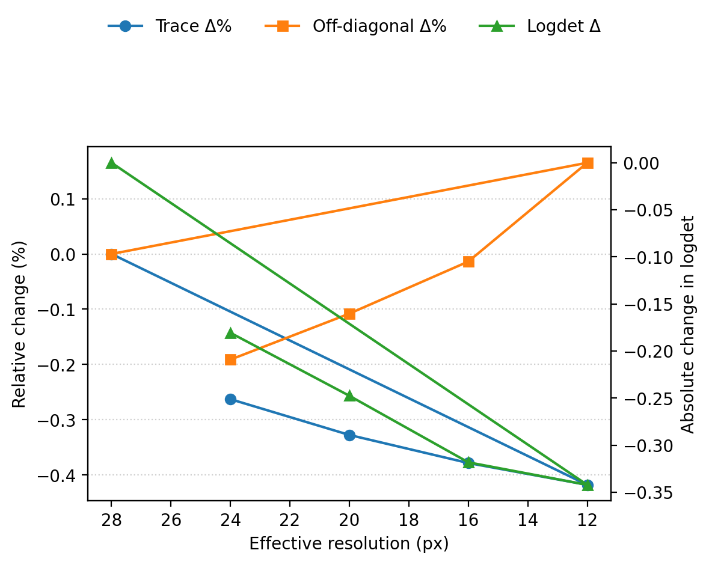

# MNIST Perturbation Study — Noise & Resolution Effects on CLIP MCDO

## 1. Motivation & Context
- Builds on the dropout-instrumented MNIST analysis (`REPORT.md`), probing how input corruptions translate into Monte Carlo Dropout (MCDO) uncertainty for `openai/clip-vit-base-patch32`.
- Focus: additive Gaussian noise and resolution loss, two ubiquitous failure modes in vision systems.
- Objective: characterise shifts in embedding covariance geometry and predictive diagnostics across perturbation strengths, highlighting which digits are most sensitive.

## 2. Experimental Configuration
- **Data**: first 128 samples from the MNIST test split (class-balanced subset covering digits 0–9).
- **Backbone & instrumentation**: CLIP ViT-B/32 with dropout adapters (`p = 0.1`) on all 12 vision transformer blocks plus the projection head, mirroring the prior study’s “all layers” setting.
- **Sampling protocol**: 32 stochastic passes per image, micro-batch size 4, temperature `τ = 1.0`, deterministic seeds, predictive head enabled to read mutual information and entropy.
- **Metrics saved**: per-sample CSV/JSON (trace, logdet, off-diagonal mass, predicted label, entropy, MI, confidence) plus aggregated statistics (`runs/mnist_perturbations_noise_res_dropout_v1/aggregated_metrics.csv`). Plot-ready tables live under `../../report_assets/mnist_mcdo/`.
- **Reproduction command**:
  ```bash
  python -m mcdo.perturbation_study \
    --limit 128 \
    --passes 32 \
    --microbatch 4 \
    --noise-stds 0.0,0.05,0.1,0.2,0.35 \
    --downsample-sizes 24,20,16,12 \
    --out-root runs/mnist_perturbations_noise_res_dropout_v1 \
    --adapter-target visual_projection \
    --adapter-target vision_model.encoder.layers.0 \
    --adapter-target vision_model.encoder.layers.1 \
    --adapter-target vision_model.encoder.layers.2 \
    --adapter-target vision_model.encoder.layers.3 \
    --adapter-target vision_model.encoder.layers.4 \
    --adapter-target vision_model.encoder.layers.5 \
    --adapter-target vision_model.encoder.layers.6 \
    --adapter-target vision_model.encoder.layers.7 \
    --adapter-target vision_model.encoder.layers.8 \
    --adapter-target vision_model.encoder.layers.9 \
    --adapter-target vision_model.encoder.layers.10 \
    --adapter-target vision_model.encoder.layers.11
  ```

## 3. Perturbation Catalogue
- **Baseline**: untouched MNIST digit (converted to RGB by the CLIP processor).
- **Gaussian noise**: add zero-mean noise with σ ∈ {0.05, 0.10, 0.20, 0.35} (in `[0,1]` space), clip to maintain valid intensities, then feed through CLIP preprocessing.
- **Spatial downsampling**: resize to {24, 20, 16, 12} px with bilinear filtering and upscale back to 28 px, mimicking blurrier capture devices while preserving aspect ratio.

All scenarios inherit the same model weights, adapter configuration, and random seed, isolating the effect of the perturbations themselves.

## 4. Metrics of Interest
- **Trace (`Tr Σ`)** — total variance across the 512-D embedding cloud.
- **Log-determinant (`log det Σ`)** — approximate log-volume of the covariance ellipsoid.
- **Off-diagonal mass** — L₁ sum of off-diagonal entries, capturing cross-dimensional coupling.
- **Predictive diagnostics** — top-1 accuracy, BALD-style mutual information, per-pass entropy, and max softmax confidence computed from the text head prompts.

Baseline reference (σ=0, native resolution): trace 39.12, logdet -6656.75, off-diagonal mass 3426.30, accuracy 11.7%, MI ≈ 9.8×10⁻⁶, confidence 0.1009.

## 5. Results

### 5.1 Aggregate behaviour under noise
| Noise σ | Trace | Δ Trace (%) | Logdet | Δ Logdet | Off-diag | Δ Off (%) | Confidence | Δ Conf (×1e-4) |
| --- | ---: | ---: | ---: | ---: | ---: | ---: | ---: | ---: |
| 0.05 | 39.50 | 0.96% | -6656.9 | -0.15 | 3416.6 | -0.28% | 0.101002 | 0.92 |
| 0.10 | 39.68 | 1.42% | -6656.9 | -0.17 | 3435.1 | 0.26% | 0.101033 | 1.23 |
| 0.20 | 39.85 | 1.87% | -6657.0 | -0.21 | 3451.3 | 0.73% | 0.101043 | 1.34 |
| 0.35 | 39.92 | 2.04% | -6657.1 | -0.31 | 3456.5 | 0.88% | 0.101038 | 1.28 |



Noise steadily expands the trace (≈ +2% at σ = 0.35) and nudges off-diagonal mass upward, indicating broader yet more correlated embedding clouds. The simultaneous decline in logdet points to variance concentrating along fewer dominant axes rather than an isotropic inflation.

### 5.2 Aggregate behaviour under downsampling
| Downsample size | Trace | Δ Trace (%) | Logdet | Δ Logdet | Off-diag | Δ Off (%) | Confidence | Δ Conf (×1e-4) |
| --- | ---: | ---: | ---: | ---: | ---: | ---: | ---: | ---: |
| 24 | 39.02 | -0.26% | -6656.9 | -0.18 | 3419.8 | -0.19% | 0.100958 | 0.48 |
| 20 | 38.99 | -0.33% | -6657.0 | -0.25 | 3422.6 | -0.11% | 0.100962 | 0.53 |
| 16 | 38.97 | -0.38% | -6657.1 | -0.32 | 3425.8 | -0.01% | 0.100966 | 0.56 |
| 12 | 38.96 | -0.42% | -6657.1 | -0.34 | 3432.0 | 0.16% | 0.100958 | 0.48 |



Coarser inputs slightly dampen variance (≤ -0.42% trace change) and reduce cross-dimensional coupling until the smallest 12 px case, where aliasing begins to re-introduce correlations.

### 5.3 Digit-level sensitivity snapshot
Per-digit trace shifts (relative to baseline) highlight which classes drive the bulk changes. Values correspond to the most disruptive noise level (σ = 0.35) and the strongest downsampling (12 px).

| Digit | Trace (baseline) | Trace (σ = 0.35) | Δσ=0.35 | Trace (12 px) | Δ12px |
| ---: | ---: | ---: | ---: | ---: | ---: |
| 0 | 39.093 | 40.050 | +0.957 | 39.118 | +0.025 |
| 1 | 38.425 | 38.982 | +0.557 | 38.187 | -0.238 |
| 2 | 39.040 | 40.107 | +1.066 | 38.752 | -0.288 |
| 3 | 39.696 | 40.381 | +0.685 | 39.447 | -0.250 |
| 4 | 38.834 | 39.639 | +0.805 | 38.731 | -0.103 |
| 5 | 39.155 | 40.045 | +0.890 | 38.942 | -0.212 |
| 6 | 40.165 | 41.126 | +0.961 | 40.057 | -0.109 |
| 7 | 39.384 | 40.165 | +0.781 | 39.266 | -0.118 |
| 8 | 36.686 | 37.607 | +0.922 | 36.217 | -0.468 |
| 9 | 39.119 | 39.783 | +0.665 | 38.968 | -0.151 |

- Loop-heavy digits (2, 6, 8) accumulate > +0.9 trace under strong noise, reflecting heightened ambiguity when stroke boundaries are perturbed.
- Simpler shapes (1, 4, 7) lose variance under downsampling, as coarse inputs collapse alternative interpretations for straight strokes.

### 5.4 Predictive head behaviour
- Accuracy remains flat at 11.7% across all scenarios, confirming that prompt mismatch, not corruption, limits classification.
- Confidence increases marginally under noise (≈ +1.3×10⁻⁴) and barely shifts with resolution loss (< +0.6×10⁻⁴). Entropy and MI remain pinned at ~2.3026 and ~1×10⁻⁵ respectively.
- Predictive statistics therefore offer little discriminative power for these corruptions; embedding-space diagnostics are the informative signal for this study.

### 5.5 Summary of observations
1. **Noise inflates the cloud** — linear growth in trace and off-diagonal mass, paired with lower logdet, indicates broader but more anisotropic uncertainty ellipsoids.
2. **Resolution loss contracts variance** — coarser inputs reduce both trace and cross-covariance, save for extreme blur where mild aliasing reappears.
3. **Class sensitivity is structured** — digits with loops or diagonals respond strongest to noise, while straight-stroke digits are more affected by downsampling.
4. **Predictive metrics are inert** — CLIP’s default MNIST prompts keep entropy and accuracy saturated irrespective of corruption strength.

## 6. Limitations & Follow-ups
- **Prompt quality**: Without MNIST-specific prompts or a linear probe, predictive accuracy remains near chance, masking relationships between uncertainty and correctness.
- **Single backbone**: The study isolates CLIP ViT-B/32. Replicating on convolutional encoders or larger vision transformers would reveal whether the trends generalise.
- **Corruption diversity**: Only Gaussian noise and isotropic downsampling were covered. Extending to contrast shifts, elastic warps, or structured occlusions would give a fuller robustness profile.
- **Dropout schedule**: A single adapter probability (`p = 0.1`) was used. Sweeping dropout strength could uncover nonlinear interactions between corruption severity and stochastic variance.

Planned explorations:
1. Add corruption families beyond noise/blur (e.g., brightness, rotation) and chart multi-dimensional response surfaces.
2. Introduce stronger prompt engineering or lightweight probes so predictive metrics become informative alongside embedding covariance.
3. Package the perturbation study as a configuration in an `experiments/` registry to ease reruns on future backbones or datasets.
