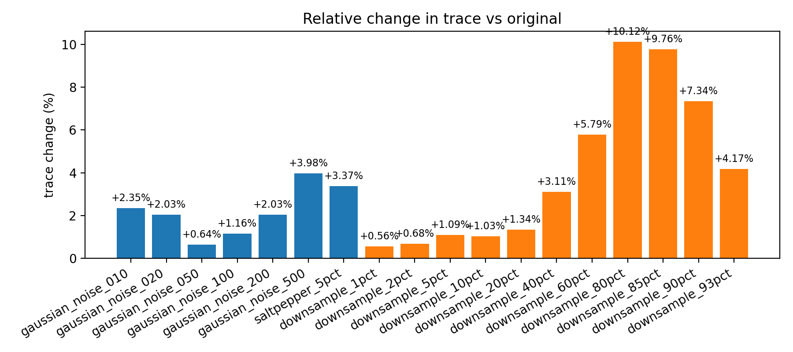
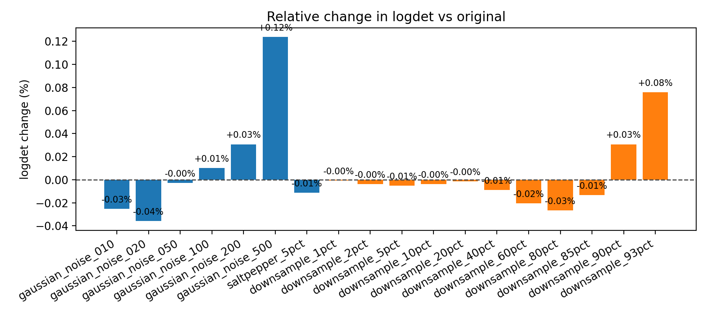
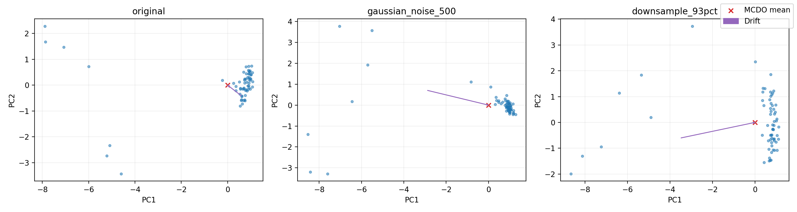
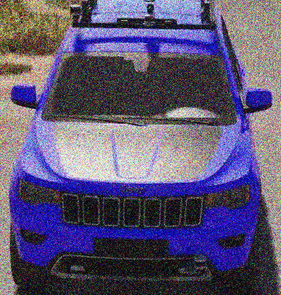
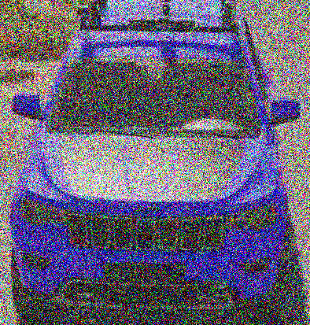
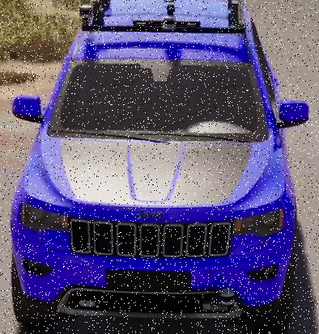

# Sim2 45° CLIP MCDO Noise Study

## 1. Introduction
We study how additive noise and progressive downsampling alter the geometry of CLIP image embeddings when Monte Carlo Dropout (MCDO) is applied to the vision tower. The goal is to quantify how perturbations change the stochastic embedding cloud (variance, orientation, and mean drift) so we can anticipate failure modes in downstream retrieval or classification settings.
All analyses focus on embedding-space diagnostics rather than classifier accuracy, mirroring a scientific report structure: we document the experimental configuration, define uncertainty metrics, and then interpret how those metrics respond to perturbations of increasing severity.

## 2. Methodology
- **Dataset:** data/car_sim/sim2_cropped_45deg
- **Model:** openai/clip-vit-base-patch32
- **Dropout p:** 0.01
- **Passes:** 64
- **Images:** 46
- **Dropout instrumentation:** DropoutAdapter wraps all twelve ViT encoder blocks plus the visual projection head (p = 0.01).
- **Sampling:** 64 stochastic passes per image (microbatch 4, deterministic seed). Deterministic baselines use a single pass with dropout disabled.
- **Perturbation sweep:** Gaussian noise σ∈{0.01,…,0.5} and downsampling up to 93% (224→16 px) followed by bicubic upsampling.
- **Pass-stability sweep:** Additional runs at T∈{2,4,8,16,32,64,128} for original, strongest-noise, and strongest-downsampling cases.

## 3. Metric Primer
- **Trace (Tr Σ):** Sum of covariance eigenvalues; measures total dispersion of the embedding cloud. Increases imply broader uncertainty.
- **Log-determinant (log det Σ):** Log-volume of the covariance ellipsoid. It captures how uncertainty spreads across dimensions; drops signal collapse into a lower-dimensional subspace.
- **Off-diagonal mass:** L₁ magnitude of non-diagonal covariance entries; indicates cross-dimensional coupling and anisotropy.
- **Mean shift / Mahalanobis shift:** L2 distance and covariance-normalised distance between the stochastic mean and the deterministic embedding, quantifying drift induced by perturbations.
- **Tangent trace / λₘₐₓ:** Variance within the hypersphere orthogonal to the mean direction; highlights changes in directional uncertainty.
- **Spectral entropy & top-10 share:** Describe how variance concentrates across eigenmodes. Lower entropy or higher top-10 share means uncertainty is dominated by a few directions.
- **Circular variance:** Dispersion of unit-normalised samples; complements tangent analysis by examining orientation consistency.
- **Pass-count stability:** How rapidly trace/logdet estimates converge as the number of stochastic passes T increases.

## 4. Aggregate MCDO Embedding Metrics
| transform | trace | logdet | off-diag mass |
| --- | --- | --- | --- |
| original | 12.3135 ± 2.6974 | -6376.0333 ± 10.0092 | 1609.7769 ± 490.2831 |
| gaussian_noise_010 | 12.6023 ± 2.7577 | -6374.4188 ± 9.8618 | 1637.2628 ± 489.9699 |
| gaussian_noise_020 | 12.5631 ± 2.6985 | -6373.7425 ± 9.3996 | 1578.3083 ± 471.0835 |
| gaussian_noise_050 | 12.3926 ± 2.6261 | -6375.8614 ± 8.2435 | 1554.1500 ± 465.1700 |
| gaussian_noise_100 | 12.4558 ± 2.5969 | -6376.6802 ± 7.1463 | 1554.7016 ± 455.9900 |
| gaussian_noise_200 | 12.5629 ± 2.5728 | -6377.9926 ± 6.7516 | 1515.4276 ± 458.6859 |
| gaussian_noise_500 | 12.8031 ± 2.7534 | -6383.9255 ± 6.6858 | 1419.4581 ± 431.2209 |
| saltpepper_5pct | 12.7279 ± 2.5296 | -6375.3044 ± 6.3954 | 1533.5533 ± 450.0526 |
| downsample_1pct | 12.3825 ± 2.6268 | -6375.9890 ± 9.1654 | 1581.4901 ± 470.5102 |
| downsample_2pct | 12.3977 ± 2.6292 | -6375.7912 ± 9.2649 | 1582.6807 ± 469.3839 |
| downsample_5pct | 12.4478 ± 2.6403 | -6375.7133 ± 9.0908 | 1583.8291 ± 468.7956 |
| downsample_10pct | 12.4398 ± 2.6474 | -6375.7898 ± 9.0936 | 1583.6615 ± 468.6407 |
| downsample_20pct | 12.4790 ± 2.6145 | -6375.9428 ± 8.7840 | 1585.3060 ± 469.0101 |
| downsample_40pct | 12.6968 ± 2.5948 | -6375.4607 ± 8.3049 | 1591.4691 ± 464.4259 |
| downsample_60pct | 13.0259 ± 2.5301 | -6374.7296 ± 7.5273 | 1596.7464 ± 451.3209 |
| downsample_80pct | 13.5591 ± 2.5690 | -6374.3342 ± 6.5821 | 1558.9208 ± 451.8482 |
| downsample_85pct | 13.5157 ± 2.6575 | -6375.1753 ± 6.4177 | 1530.2184 ± 465.0788 |
| downsample_90pct | 13.2171 ± 2.5903 | -6377.9928 ± 6.2483 | 1445.2168 ± 435.0733 |
| downsample_93pct | 12.8271 ± 2.6290 | -6380.8724 ± 6.6015 | 1409.7417 ± 420.4236 |
Baseline trace is 12.31, with logdet -6376.03 and off-diagonal mass 1609.78. Noise and downsampling progressively broaden the covariance while gradually reducing logdet, especially for the most aggressive settings.

## 5. Deterministic Baseline (1 pass, dropout disabled)
| transform | trace | logdet | off-diag mass |
| --- | --- | --- | --- |
| original | 5.12e-04 | -7073.5400 | 0.0000 |
| gaussian_noise_010 | 5.12e-04 | -7073.5400 | 0.0000 |
| gaussian_noise_020 | 5.12e-04 | -7073.5400 | 0.0000 |
| gaussian_noise_050 | 5.12e-04 | -7073.5400 | 0.0000 |
| gaussian_noise_100 | 5.12e-04 | -7073.5400 | 0.0000 |
| gaussian_noise_200 | 5.12e-04 | -7073.5400 | 0.0000 |
| gaussian_noise_500 | 5.12e-04 | -7073.5400 | 0.0000 |
| saltpepper_5pct | 5.12e-04 | -7073.5400 | 0.0000 |
| downsample_1pct | 5.12e-04 | -7073.5400 | 0.0000 |
| downsample_2pct | 5.12e-04 | -7073.5400 | 0.0000 |
| downsample_5pct | 5.12e-04 | -7073.5400 | 0.0000 |
| downsample_10pct | 5.12e-04 | -7073.5400 | 0.0000 |
| downsample_20pct | 5.12e-04 | -7073.5400 | 0.0000 |
| downsample_40pct | 5.12e-04 | -7073.5400 | 0.0000 |
| downsample_60pct | 5.12e-04 | -7073.5400 | 0.0000 |
| downsample_80pct | 5.12e-04 | -7073.5400 | 0.0000 |
| downsample_85pct | 5.12e-04 | -7073.5400 | 0.0000 |
| downsample_90pct | 5.12e-04 | -7073.5400 | 0.0000 |
| downsample_93pct | 5.12e-04 | -7073.5400 | 0.0000 |
All deterministic baselines remain numerically identical: covariance mass collapses to machine precision (trace 5.12e-04) with zero off-diagonal structure, underscoring that stochasticity is solely induced by dropout.

## 6. Sensitivity to Noise
| transform | Δ trace (%) | Δ logdet | Δ off-diag (%) |
| --- | --- | --- | --- |
| gaussian_noise_010 | 2.35 | 1.6145 | 1.71 |
| gaussian_noise_020 | 2.03 | 2.2908 | -1.95 |
| gaussian_noise_050 | 0.64 | 0.1719 | -3.46 |
| gaussian_noise_100 | 1.16 | -0.6468 | -3.42 |
| gaussian_noise_200 | 2.03 | -1.9593 | -5.86 |
| gaussian_noise_500 | 3.98 | -7.8921 | -11.82 |
| saltpepper_5pct | 3.37 | 0.7289 | -4.74 |
Trace grows steadily with σ; at σ=0.50 it reaches 12.80 (≈+4.0% vs baseline) while logdet drops to -6383.93, signalling that variance is expanding yet concentrating into fewer dominant axes.

## 7. Sensitivity to Downsampling
| transform | Δ trace (%) | Δ logdet | Δ off-diag (%) |
| --- | --- | --- | --- |
| downsample_1pct | 0.56 | 0.0444 | -1.76 |
| downsample_2pct | 0.68 | 0.2421 | -1.68 |
| downsample_5pct | 1.09 | 0.3200 | -1.61 |
| downsample_10pct | 1.03 | 0.2436 | -1.62 |
| downsample_20pct | 1.34 | 0.0905 | -1.52 |
| downsample_40pct | 3.11 | 0.5727 | -1.14 |
| downsample_60pct | 5.79 | 1.3038 | -0.81 |
| downsample_80pct | 10.12 | 1.6991 | -3.16 |
| downsample_85pct | 9.76 | 0.8580 | -4.94 |
| downsample_90pct | 7.34 | -1.9594 | -10.22 |
| downsample_93pct | 4.17 | -4.8391 | -12.43 |
Downsampling beyond 60% sharply increases trace (e.g., 93% reduction → trace 12.83) while logdet falls to -6380.87, indicating uncertainty balloons along a handful of directions once spatial detail is largely removed.

## 8. Cross-Metric Geometry

## 9. Mean Shift Diagnostics
| transform | L2 shift | Mahalanobis shift |
| --- | --- | --- |
| original | 1.5934 ± 0.2906 | 806.9347 ± 97.6104 |
| gaussian_noise_010 | 2.7813 ± 0.6508 | 1666.2401 ± 255.5203 |
| gaussian_noise_020 | 3.6054 ± 0.6817 | 2227.3307 ± 358.3126 |
| gaussian_noise_050 | 4.3841 ± 0.6772 | 2788.7280 ± 342.4279 |
| gaussian_noise_100 | 5.1952 ± 0.9378 | 3367.2794 ± 419.5660 |
| gaussian_noise_200 | 6.5398 ± 1.0501 | 4228.4310 ± 535.9685 |
| gaussian_noise_500 | 8.7011 ± 0.8827 | 5537.6085 ± 582.0240 |
| saltpepper_5pct | 5.8839 ± 0.9645 | 3828.5899 ± 468.3757 |
| downsample_1pct | 2.9156 ± 0.7442 | 1763.3735 ± 465.4738 |
| downsample_2pct | 2.9370 ± 0.7538 | 1767.1616 ± 482.2413 |
| downsample_5pct | 3.0156 ± 0.7507 | 1832.2940 ± 465.8001 |
| downsample_10pct | 3.1176 ± 0.7988 | 1908.4585 ± 494.0486 |
| downsample_20pct | 3.3776 ± 0.8529 | 2091.0686 ± 520.2487 |
| downsample_40pct | 4.0572 ± 0.8832 | 2561.1259 ± 518.2966 |
| downsample_60pct | 5.1260 ± 0.8931 | 3215.4408 ± 481.4732 |
| downsample_80pct | 6.9914 ± 0.7538 | 4419.8093 ± 534.7429 |
| downsample_85pct | 7.7168 ± 0.6615 | 4915.8207 ± 549.4709 |
| downsample_90pct | 8.8262 ± 0.6330 | 5610.9697 ± 584.7671 |
| downsample_93pct | 9.3279 ± 0.6722 | 5948.2206 ± 621.6978 |

## 10. Spectral & Tangent Geometry
| transform | tangent trace | tangent λmax | spectral entropy | top-10 share | circular variance |
| --- | --- | --- | --- | --- | --- |
| original | 8.5239 ± 1.6899 | 2.2936 ± 0.9171 | 2.5811 ± 0.2383 | 0.7565 ± 0.0436 | 0.0633 ± 0.0157 |
| gaussian_noise_010 | 8.7489 ± 1.7260 | 2.3569 ± 0.9274 | 2.5859 ± 0.2303 | 0.7557 ± 0.0424 | 0.0654 ± 0.0161 |
| gaussian_noise_020 | 8.7992 ± 1.6985 | 2.3006 ± 0.9398 | 2.6201 ± 0.2280 | 0.7518 ± 0.0420 | 0.0631 ± 0.0155 |
| gaussian_noise_050 | 8.5107 ± 1.6004 | 2.2645 ± 0.9120 | 2.5796 ± 0.2205 | 0.7574 ± 0.0400 | 0.0617 ± 0.0152 |
| gaussian_noise_100 | 8.4447 ± 1.5670 | 2.2813 ± 0.9015 | 2.5460 ± 0.2187 | 0.7620 ± 0.0389 | 0.0625 ± 0.0152 |
| gaussian_noise_200 | 8.2401 ± 1.3829 | 2.1899 ± 0.8128 | 2.5005 ± 0.2321 | 0.7685 ± 0.0389 | 0.0601 ± 0.0144 |
| gaussian_noise_500 | 7.7364 ± 1.4081 | 2.0397 ± 0.7857 | 2.3501 ± 0.2266 | 0.7948 ± 0.0384 | 0.0552 ± 0.0146 |
| saltpepper_5pct | 8.6093 ± 1.3903 | 2.2036 ± 0.8332 | 2.5686 ± 0.2253 | 0.7608 ± 0.0370 | 0.0626 ± 0.0142 |
| downsample_1pct | 8.6512 ± 1.6931 | 2.3227 ± 0.9141 | 2.5873 ± 0.2266 | 0.7572 ± 0.0406 | 0.0619 ± 0.0148 |
| downsample_2pct | 8.6612 ± 1.6923 | 2.3173 ± 0.9090 | 2.5889 ± 0.2245 | 0.7570 ± 0.0402 | 0.0620 ± 0.0149 |
| downsample_5pct | 8.6939 ± 1.6944 | 2.3229 ± 0.9144 | 2.5880 ± 0.2230 | 0.7574 ± 0.0400 | 0.0620 ± 0.0147 |
| downsample_10pct | 8.6884 ± 1.7005 | 2.3288 ± 0.9098 | 2.5866 ± 0.2215 | 0.7574 ± 0.0397 | 0.0620 ± 0.0147 |
| downsample_20pct | 8.7053 ± 1.6775 | 2.3396 ± 0.9162 | 2.5793 ± 0.2160 | 0.7591 ± 0.0387 | 0.0620 ± 0.0147 |
| downsample_40pct | 8.8511 ± 1.6547 | 2.3567 ± 0.9101 | 2.5755 ± 0.2080 | 0.7617 ± 0.0360 | 0.0625 ± 0.0144 |
| downsample_60pct | 8.9885 ± 1.5274 | 2.3026 ± 0.8298 | 2.5678 ± 0.1983 | 0.7650 ± 0.0341 | 0.0626 ± 0.0141 |
| downsample_80pct | 9.0825 ± 1.4530 | 2.2022 ± 0.7401 | 2.5403 ± 0.2095 | 0.7721 ± 0.0330 | 0.0598 ± 0.0141 |
| downsample_85pct | 8.8670 ± 1.4370 | 2.1181 ± 0.7449 | 2.5217 ± 0.2287 | 0.7726 ± 0.0357 | 0.0585 ± 0.0141 |
| downsample_90pct | 8.6496 ± 1.3900 | 2.1075 ± 0.7272 | 2.5033 ± 0.2229 | 0.7787 ± 0.0332 | 0.0573 ± 0.0138 |
| downsample_93pct | 8.2983 ± 1.4501 | 2.0909 ± 0.7254 | 2.4687 ± 0.2265 | 0.7821 ± 0.0337 | 0.0577 ± 0.0140 |

## 11. Pass Count Stability
We evaluate trace and log-determinant stability across Monte Carlo pass counts T ∈ {2,4,8,16,32,64,128}.
Lower T increases estimator noise; curves should flatten as T grows. See stability plots in this section if generated.

## 12. Discussion & Outlook
- **High noise (σ=0.50)** expands trace by +4.0% and drops logdet by 7.89. The stochastic mean drifts 8.70 L2 units from the deterministic embedding, and tangent variance settles around 7.74, confirming broader but directional uncertainty.
- **Extreme downsampling (93% → 16px)** shifts trace by +4.2% and drops logdet by 4.84. Mahalanobis drift reaches 5948.2, while spectral entropy averages 2.47, signalling variance concentration into fewer modes.
- **Viewpoint sensitivity:** At 225°, trace shifts by +1.38 relative to the clean view, indicating that certain orientations (e.g. flank perspectives) become the most uncertain once detail is removed.
- **Pass-count stability:** Trace estimates converge within ±3.319 by 32 passes; high-noise and heavy-downsample settings widen the band only modestly, so T=64 remains a safe budget.
- **Predictive head:** Mutual information stays near 2.54e-05 for all conditions, so predictive entropy contributes little insight compared with embedding-space diagnostics.

## 13. Class-Level Trace Shifts
| class | trace (original) | trace (saltpepper_5pct) | Δ noise | trace (downsample_93pct) | Δ downsample |
| --- | --- | --- | --- | --- | --- |
| Indigo | 11.3669 ± 1.6120 | 11.7008 ± 1.3592 | 0.3339 | 12.2583 ± 1.2720 | 0.8914 |
| Magenta | 11.9280 ± 3.2723 | 12.0372 ± 3.4081 | 0.1091 | 12.6884 ± 3.7444 | 0.7603 |
| Moose3 | 12.6069 ± 3.3034 | 14.2672 ± 3.0083 | 1.6603 | 13.4894 ± 3.3945 | 0.8825 |
| White | 13.1045 ± 2.9819 | 12.9342 ± 2.4708 | -0.1703 | 13.2767 ± 2.5596 | 0.1722 |
| Wolf2 | 11.7160 ± 2.8515 | 12.8059 ± 2.5326 | 1.0899 | 12.2501 ± 2.4074 | 0.5341 |
| Yellow | 13.2319 ± 2.3014 | 13.0068 ± 2.1829 | -0.2251 | 13.1653 ± 2.5896 | -0.0666 |

## 14. Example Perturbations
- **Unmodified image:** 
- **Additive Gaussian noise (σ = 0.01):** 
- **Additive Gaussian noise (σ = 0.02):** 
- **Additive Gaussian noise (σ = 0.05):** 
- **Additive Gaussian noise (σ = 0.1):** 
- **Additive Gaussian noise (σ = 0.2):** 
- **Additive Gaussian noise (σ = 0.5):** 
- **Salt & pepper noise (5% pixels, 60% salt):** 
- **Downsample to 222px (encoder base 224px, 1% reduction) then upscale:** 
- **Downsample to 220px (encoder base 224px, 2% reduction) then upscale:** 
- **Downsample to 213px (encoder base 224px, 5% reduction) then upscale:** 
- **Downsample to 202px (encoder base 224px, 10% reduction) then upscale:** 
- **Downsample to 179px (encoder base 224px, 20% reduction) then upscale:** 
- **Downsample to 134px (encoder base 224px, 40% reduction) then upscale:** 
- **Downsample to 90px (encoder base 224px, 60% reduction) then upscale:** 
- **Downsample to 45px (encoder base 224px, 80% reduction) then upscale:** 
- **Downsample to 34px (encoder base 224px, 85% reduction) then upscale:** 
- **Downsample to 22px (encoder base 224px, 90% reduction) then upscale:** 
- **Downsample to 16px (encoder base 224px, 93% reduction) then upscale:** 

## Appendix: Predictive Diagnostics (MI & Entropy)
Predictive mutual information (epistemic) and entropy are derived from the CLIP text head over class prompts. They remain near-zero here due to prompt unanimity and low dropout; we include them for completeness.

