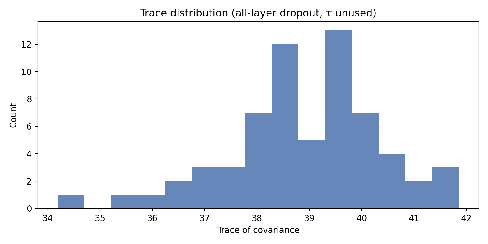
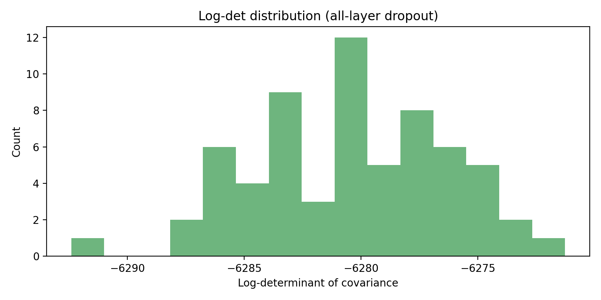
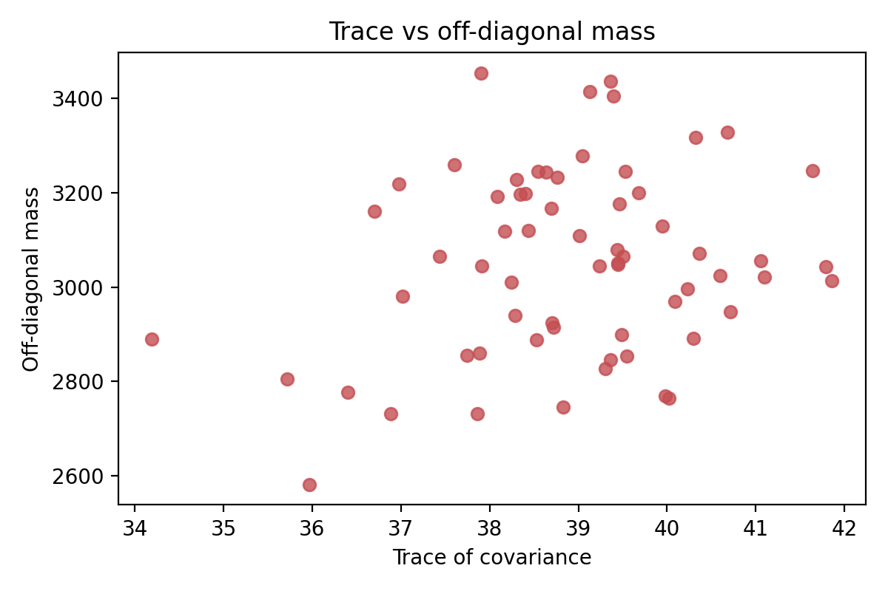
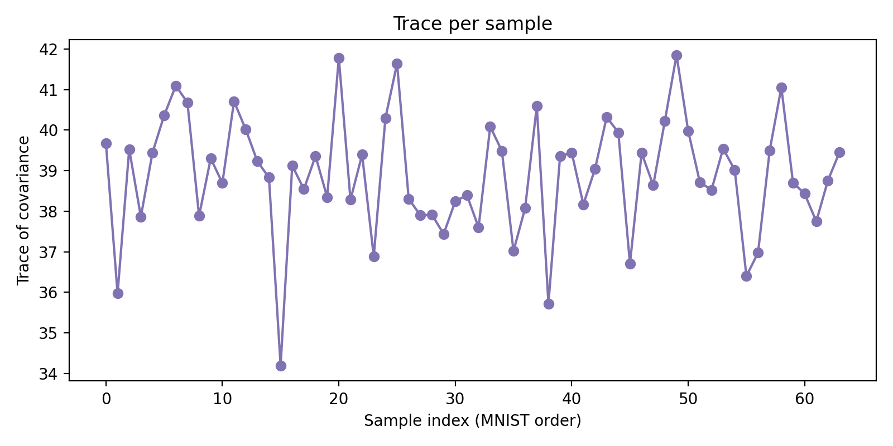
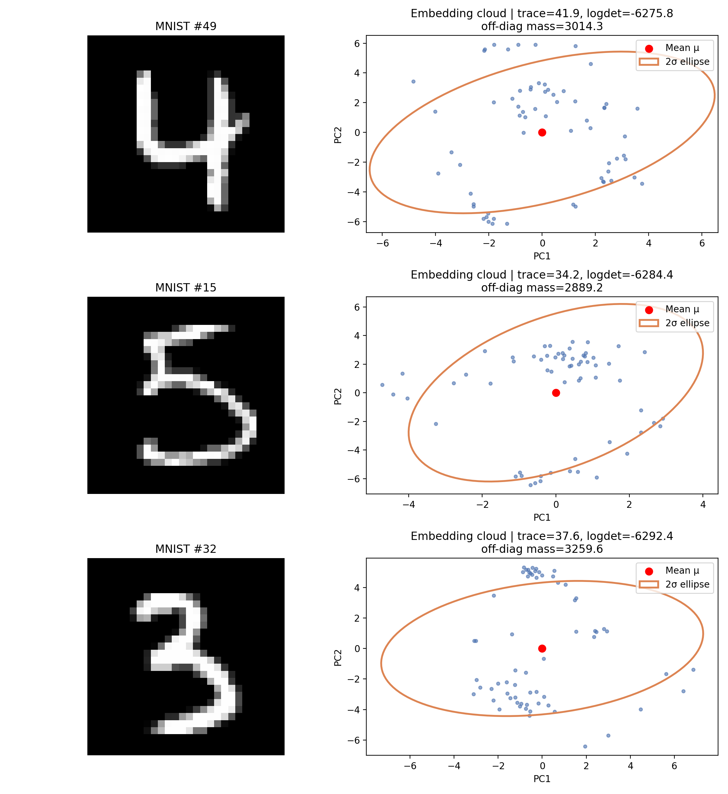

# Monte Carlo Dropout Embedding Study — CLIP ViT-B/32 on MNIST

## 1. Goal & Terminology
- **Aim**: measure how much the CLIP vision encoder’s image embedding changes when Monte Carlo Dropout (MCDO) is applied at every layer. We focus on statistics of the embedding cloud (mean vector `μ` and covariance matrix `Σ`) produced by repeated stochastic passes; no classifier or label accuracy is considered.
- **Monte Carlo Dropout (MCDO)**: repeat the forward pass with dropout active to approximate sampling from a Bayesian posterior. Here we capture 64 stochastic samples per image.
- **Trace**: the sum of the diagonal of `Σ`; it measures total variance across all embedding dimensions.
- **Log-determinant**: the log of `det(Σ)`; proportional to the log-volume of the uncertainty ellipsoid.
- **Off-diagonal mass**: the sum of the absolute values of `Σ`’s off-diagonal entries; indicates how strongly embedding dimensions co-vary.

## 2. Setup
- **Backbone**: `openai/clip-vit-base-patch32` vision tower.
- **Dropout instrumentation**: every transformer block (`vision_model.encoder.layers.{0..11}`) and the projection head (`visual_projection`) is wrapped in a `DropoutAdapter(p=0.1)`. The adapter has been updated to handle tuple outputs so it can sit directly on encoder layers (`mcdo/dropout.py`). Only `nn.Dropout` modules are toggled into training mode during sampling.
- **Sampling protocol**: 64 stochastic passes (`T = 64`) per MNIST test image (first 64 indices), micro-batch size 8, seeds locked via `set_determinism`.
- **Data products**: for each image we persist `μ`, `Σ`, and the raw embedding samples in `runs/mnist_alllayers_embeddings/individual/<index>/`.
- **Command**:
  ```bash
  python -m mcdo.mnist_driver \
    --out runs/mnist_alllayers_embeddings \
    --limit 64 \
    --passes 64 \
    --microbatch 8 \
    --adapter-drop 0.1 \
    --adapter-target visual_projection \
    --adapter-target vision_model.encoder.layers.0 \
    ... \
    --adapter-target vision_model.encoder.layers.11 \
    --save-raw \
    --no-predictive
  ```
  The `--no-predictive` flag skips the text head entirely so the study reports only embedding statistics.

## 3. Embedding Variance Summary
- **Mean trace**: 38.9 (std 1.1) across the 64-sample subset.
- **Mean log-det**: −6280.7 (std 2.1).
- **Mean off-diagonal mass**: 3059.3 (std 120.3).
  (Source: `reports/mnist_mcdo/report_stats_embeddings.json`.)


*Trace spans roughly 35–41, confirming that dropout at every layer widens the embedding distribution compared to projection-only dropout.*


*Log-volumes show a compact band (~3 log-units wide), indicating the overall uncertainty ellipsoid scales consistently across digits.*


*Higher total variance correlates with stronger cross-dimensional covariance, suggesting dropout perturbs many embedding axes simultaneously.*


*Trace varies smoothly across MNIST indices; no single digit collapses the MCDO variance.*

## 4. Embedding Clouds
To visualise the stochastic cloud for representative digits, we project each sample’s 64 embeddings onto the first two principal directions of its covariance and overlay a 2σ ellipse.



Even though predictive confidences were not computed, the figure shows rich structure: some digits exhibit narrow ellipses (low trace) while others admit broad, tilted shapes, confirming that MCDO exposes meaningful variability in CLIP’s feature space.


This study isolates the variance introduced by Monte Carlo Dropout in CLIP’s embedding space, avoiding any downstream classification metrics and providing concrete diagnostics (trace, log-det, cross-covariance, and geometric visualisations) for further analysis.
