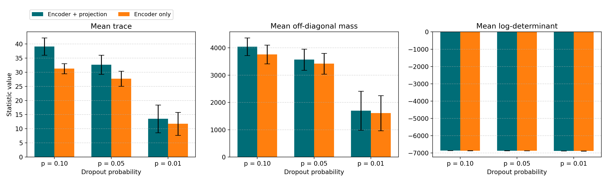
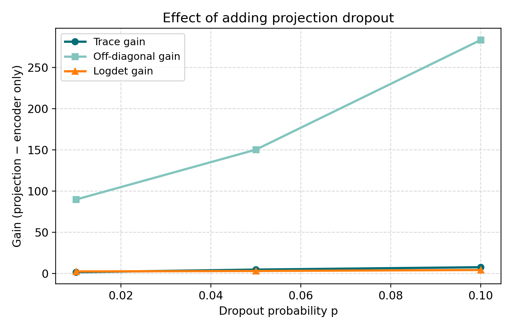
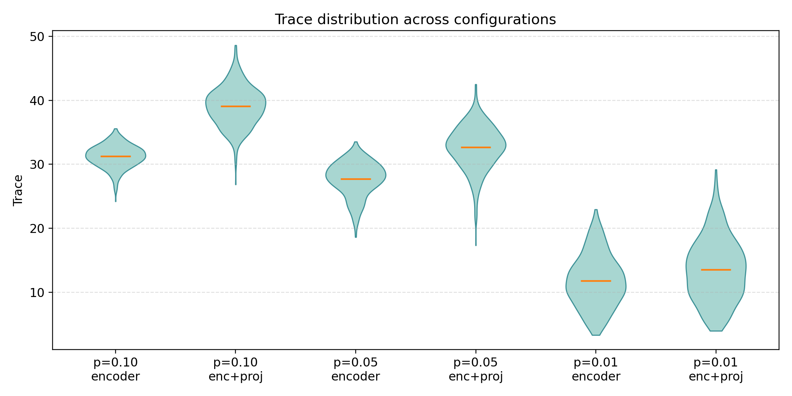
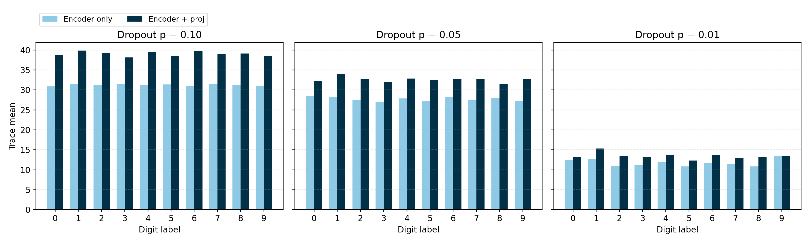

# MNIST Monte Carlo Dropout Grid — Encoder vs Projection Scope

## 1. Configuration
- **Backbone**: `openai/clip-vit-base-patch32` (vision tower only).
- **Dataset slice**: 500 MNIST test images (digits 0–9 balanced as drawn).
- **Sampling**: 16 Monte Carlo passes per image, micro-batch size 4, deterministic seeds.
- **Dropout injection**: `DropoutAdapter` wraps every transformer block (`vision_model.encoder.layers.{0..11}`); the projection head (`visual_projection`) is toggled on or off per condition.
- **Probabilities**: 𝑝 ∈ {0.10, 0.05, 0.01}. 
- **Outputs**: `metrics.csv` per run (trace, logdet, off-diagonal mass) plus consolidated `summary.json` files.
- **Run directories**: `runs/mnist_alllayers_p010_T16`, `runs/mnist_encoder_p010_T16`, `runs/mnist_alllayers_p005_T16`, `runs/mnist_encoder_p005_T16`, `runs/mnist_alllayers_p001_T16`, `runs/mnist_encoder_p001_T16`.

## 2. Aggregate Metrics (500 samples each)
| Dropout p | Scope | mean(trace) | σ(trace) | mean(logdet) | mean(off-diag mass) |
| --- | --- | --- | --- | --- | --- |
| 0.10 | encoder + projection | 39.08 | 3.07 | −6859.14 | 4042.69 |
| 0.10 | encoder only | 31.26 | 1.77 | −6863.60 | 3759.19 |
| 0.05 | encoder + projection | 32.65 | 3.41 | −6863.61 | 3569.95 |
| 0.05 | encoder only | 27.71 | 2.67 | −6866.86 | 3419.52 |
| 0.01 | encoder + projection | 13.51 | 4.92 | −6880.46 | 1698.80 |
| 0.01 | encoder only | 11.76 | 4.06 | −6883.16 | 1608.87 |

Key takeaways:
- Adding dropout to the projection head consistently boosts total covariance trace (e.g., +7.82 at p=0.10) and pushes log-volume (logdet) upward by 2–4 units despite identical stochastic depth elsewhere.
- Variance collapses rapidly as p falls: moving from 0.10 → 0.01 cuts trace ~3× and off-diagonal mass ~2.4×, indicating much tighter embedding clouds.
- Lowering p increases relative dispersion (σ/mean) because many samples approach deterministic behaviour; tails get heavier even as overall variance shrinks.

Overall, projection dropout consistently lifts the mean statistics while making the distribution broader: the standard deviation of trace climbs from 1.77 (encoder only, p = 0.10) to 3.07 once the projection head participates, and the heavy-tailed behaviour becomes especially visible at p = 0.01 where a handful of samples retain double-digit trace while the majority huddle below 15.

_Reading the log-determinant:_ the values hover around −6.86×10³ because the covariance is 512-dimensional. Each eigenvalue is the variance along one embedding axis; their product is the determinant, so the logdet is the sum of 512 log-variances. Dividing the mean logdet by 512 gives an average log-eigenvalue of about −13.4 (variance ≈ 1.6×10⁻⁶), which is a compact, intuitive scale. A seemingly small +4 shift in logdet still matters: `exp(4) ≈ 54`, so the uncertainty volume expands ~54× even though the baseline offset is dominated by dimensionality.

## 3. Run-by-Run Snapshots
- **p = 0.10, encoder + projection (`runs/mnist_alllayers_p010_T16`)**: trace mean 39.08 ± 3.07, logdet −6859.14 ± 1.72, off-diagonal mass 4042.69 ± 323.16. Projection dropout adds 7.82 trace points over the encoder-only baseline and broadens covariance by ≈284 units.
- **p = 0.10, encoder only (`runs/mnist_encoder_p010_T16`)**: trace 31.26 ± 1.77, logdet −6863.60 ± 2.27, off-diagonal 3759.19 ± 344.36. Variance remains elevated relative to lower p values but the embedding cloud is markedly tighter without projection noise.
- **p = 0.05, encoder + projection (`runs/mnist_alllayers_p005_T16`)**: trace 32.65 ± 3.41, logdet −6863.61 ± 1.71, off-diagonal 3569.95 ± 387.15. Variability contracts ≈17% versus p=0.10 yet projection dropout still delivers a 150-unit covariance boost.
- **p = 0.05, encoder only (`runs/mnist_encoder_p005_T16`)**: trace 27.71 ± 2.67, logdet −6866.86 ± 1.88, off-diagonal 3419.52 ± 381.56. This setting offers the best variance/complexity trade-off if projection dropout is undesirable.
- **p = 0.01, encoder + projection (`runs/mnist_alllayers_p001_T16`)**: trace 13.51 ± 4.92, logdet −6880.46 ± 3.19, off-diagonal 1698.80 ± 714.14. Embeddings nearly collapse to the deterministic limit, making stochastic estimates noisier.
- **p = 0.01, encoder only (`runs/mnist_encoder_p001_T16`)**: trace 11.76 ± 4.06, logdet −6883.16 ± 3.06, off-diagonal 1608.87 ± 642.90. The smallest variance budget but also the most fragile estimates; increasing the number of passes would help.

## 4. Representative Samples
- p = 0.10 encoder + projection: index 439 (digit 6) reached trace 48.61 with off-diagonal 4676, highlighting how projection dropout creates very wide clouds; the tightest case in this run was index 282 (digit 7) with trace 26.85 and off-diagonal 2728.
- p = 0.10 encoder only: index 178 (digit 1) topped trace at 35.58 while index 334 (digit 3) compressed to 24.20 with low off-diagonal 2550, showing the narrower spread without projection noise.
- p = 0.05 encoder + projection: index 418 (digit 2) recorded trace 42.50 and off-diagonal 4157; at the other extreme index 110 (digit 8) shrank to trace 17.33 and off-diagonal 1958 as dropout probability fell.
- p = 0.05 encoder only: index 153 (digit 5) still hit trace 33.54 whereas index 437 (digit 3) dropped to 18.61, underscoring how encoder-only dropout keeps variance moderate.
- p = 0.01 encoder + projection: index 72 (digit 2) managed trace 29.17 yet most samples clustered much lower, such as index 334 (digit 3) at trace 3.96 with off-diagonal 423.
- p = 0.01 encoder only: index 400 (digit 2) held the peak trace 22.95 while index 374 (digit 8) nearly collapsed to trace 3.30, confirming that low p with no projection dropout becomes almost deterministic.

## 5. Digit-Level Notes
- At `p = 0.10` the model with projection dropout shows the largest trace for digit **1** (39.87) and the smallest for **3** (38.17), pointing to class-dependent sensitivity.
- Removing projection dropout shifts the maximum trace to digit **7** (31.58) and the minimum to **0** (30.89), suggesting the projection head amplifies uncertainty for faces with vertical strokes.
- At `p = 0.05`, digits **1** (max) and **8** (min) dominate the spread; at `p = 0.01` the highest variance comes from **1** (all layers) or **9** (encoder only) while **5/8** are the tightest.
- Off-diagonal mass follows the same trend: projection dropout contributes ~150–284 extra units at higher p, indicating broader cross-dimensional coupling.

## 6. Sampling Barometer

- Run time per sweep (CPU only) was 6–7 minutes; total grid completed in ~40 minutes.
- Each pass re-enables dropout (`model.apply(enable_mc_dropout)`) so non-dropout modules stay in evaluation mode.
- No predictive head was evaluated (`--no-predictive`), letting us attribute covariance changes purely to the vision embeddings.

## 7. Recommendations
1. If projection dropout is computationally acceptable, keep it: it consistently expands uncertainty volume without destabilising logdet.
2. For lighter stochasticity (p ≤ 0.01) consider increasing passes beyond 16—variance estimates become noise-dominated otherwise (σ comparable to the mean).
3. Next step: extend the grid to include predictive heads (remove `--no-predictive`) to see how embedding spread translates into classification uncertainty.
