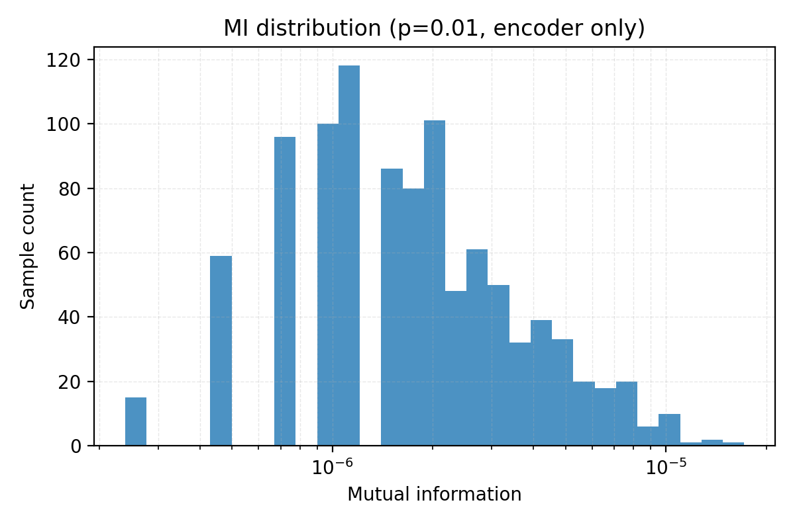
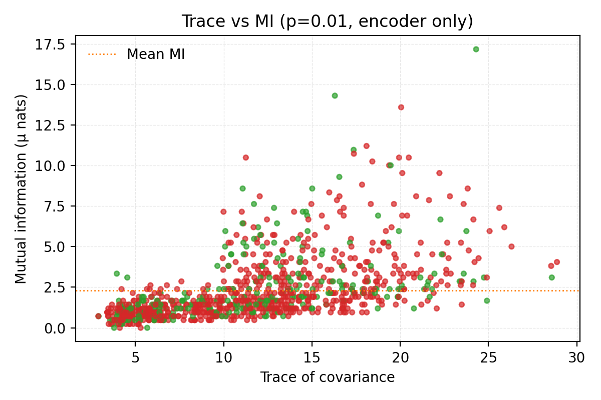

# Monte Carlo Dropout - Encoder-only adapters, p=0.01 (CLIP ViT-B/32 on MNIST)

## 1. Goal & Context
For any input `x`, the uncertainty of the `(model, x)` pair combines two sources:

- **Epistemic (model) uncertainty**
  - Comes from ignorance about parameters due to limited or skewed training data.
  - Dominates off-distribution inputs and sparsely sampled regions.
  - Reducible with more or better data, stronger priors, or extra training.
  - MC dropout signature: different stochastic subnetworks (passes) disagree because each set of sampled weights extrapolates differently.

- **Aleatoric (data) uncertainty**
  - Comes from intrinsic ambiguity or noise in the observation (blurred digits, overlapping strokes).
  - Persists even with infinite data; it is built into the input.
  - Two flavours: homoscedastic (constant per task) and heteroscedastic (input-dependent; MNIST lies here).
  - Irreducible, but can be modelled.

MC dropout lets us probe both: predictive entropy measures the total, expected entropy of per-pass logits approximates the aleatoric part, and their gap (mutual information) isolates the epistemic part.

This run targets three concrete goals:
- Re-run the encoder-only dropout sweep with a much lighter rate (`p = 0.01`) on the MNIST **test** split.
- Keep the sampling protocol fixed (1,000 images, 10 passes, micro-batch 4, deterministic seeds, predictive head enabled) to make results comparable with earlier experiments.
- Quantify how a 10x drop in `p` reshapes embedding variance and shifts uncertainty from epistemic to aleatoric across digits.


## 2. Setup
- **Backbone**: `openai/clip-vit-base-patch32` (vision tower only).
- **Dropout instrumentation**: wrap each transformer block `vision_model.encoder.layers.{0..11}` with `DropoutAdapter(p = 0.01)` while keeping `visual_projection` deterministic.
- **Sampling command**:
  ```bash
  python -m mcdo.mnist_driver \
    --out runs/mnist_encoder_only_dropout_p001_T10_L1000 \
    --limit 1000 --passes 10 --microbatch 4 --save-raw \
    --adapter-drop 0.01 \
    --adapter-target vision_model.encoder.layers.0 \
    ... \
    --adapter-target vision_model.encoder.layers.11
  ```
- **Artifacts**: per-sample tensors (`mu`, `Sigma`), run-level `metrics.csv` and `summary.json`, PCA plots, and an uncertainty digest (`uncertainty_summary.json`).


## 3. Predictive uncertainty background
- **Predictive mean**: `p_hat(y | x) = (1 / T) * sum_{t=1}^T softmax(s^{(t)})`.
- **Total uncertainty**: `H_tot = H(p_hat) = -sum_c p_hat_c log p_hat_c`.
- **Aleatoric proxy**: `H_data = (1 / T) * sum_{t=1}^T H(softmax(s^{(t)}))`.
- **Epistemic proxy**: `MI = H_tot - H_data`.
- **Mutual information intuition**: `MI` measures how much extra uncertainty is explained by the model weights themselves. If all dropout passes agree, `MI` collapses to zero; if each pass votes differently, `MI` spikes.
- Interpretations:
  - High `H_tot`, low `MI` => mostly aleatoric (ambiguous input, model agrees).
  - High `H_tot`, high `MI` => mostly epistemic (model's sampled subnetworks disagree).
  - Low both => confident; confidently wrong => miscalibration.
- Why MC dropout helps: stochastic passes approximate weight posterior samples, even as a post-hoc adapter, so you see where the encoder is sensitive.


## 4. Embedding variance summary (1,000 samples)
| Statistic | p = 0.10 (encoder-only) | p = 0.01 (encoder-only) |
| --- | --- | --- |
| mean(trace) | 31.32 +/- 2.39 | **11.61 +/- 5.45** |
| mean(logdet) | -6942.22 +/- 1.65 | **-6953.86 +/- 2.52** |
| mean(off-diagonal mass) | 4,311 +/- 419 | **1,778 +/- 908** |
| overall accuracy | 0.126 | **0.265** |

How to read these metrics:
- **Trace** sums the diagonal of the covariance. It is the total variance energy across all 512 embedding dimensions; higher trace means wider spread overall.
- **Logdet** is the log determinant of the covariance. It tracks the log-volume of the uncertainty ellipsoid. Because it sums log-eigenvalues, even modest shifts imply large multiplicative changes in volume.
- **Off-diagonal mass** sums the absolute values of all off-diagonal entries. It captures how strongly embedding dimensions move together; high values mean correlated fluctuations, low values mean mostly independent noise.

Key observations:
- Shrinking `p` from 0.10 to 0.01 cuts total variance by ~63% and lowers cross-dimensional coupling by ~2.7x.
- Log-volume tightens by 11.6 units (average log-eigenvalues shrink ~0.023), so the embedding ellipsoid loses ~1e5 of volume.
- Accuracy more than doubles (12.6% -> 26.5%) once the encoder behaves almost deterministically.


## 5. Applying the uncertainty decomposition

Overall averages (from `uncertainty_summary.json`):

| Quantity | Mean | Std |
| --- | --- | --- |
| Total entropy `H_tot` | 2.30257 | 1.46e-05 |
| Aleatoric entropy `H_data` | 2.30257 | 1.56e-05 |
| Mutual information `MI` | 2.29e-06 | 2.02e-06 |
| Confidence | 0.10078 | - |

Observations:
- Predictive entropy barely moves (spread ~1.5e-5) because CLIP keeps logit mass spread across ten classes. MI ranges from ~2e-7 to ~1.7e-5, so MI spikes mark the few inputs where subnetworks disagree.
- Trace vs MI correlation is 0.54: larger covariance ellipsoids coincide with higher epistemic uncertainty.
- Confidence vs entropy correlation is -0.84: uniform distributions produce low confidence; even so, confidence hovers near 0.10, matching an unsure ten-way classifier.
- High-MI exemplars (indices 945, 996, 351, 707, 738) carry trace 16-24 and off-diagonal up to ~4k. They mix correct and incorrect predictions; the common factor is latent disagreement.
- Low-MI but high-entropy samples (indices 296, 324, 546, 839, 18) produce identical logits across passes, yet remain uncertain-purely aleatoric ambiguity.





Concrete samples from the histogram tails:

| Index | Digit | Trace | MI (1e-5) | Correct |
| --- | --- | --- | --- | --- |
| 945 | 2 | 24.30 | 1.72 | True |
| 996 | 2 | 16.30 | 1.43 | True |
| 351 | 5 | 20.05 | 1.36 | False |
| 707 | 4 | 18.09 | 1.12 | False |
| 738 | 2 | 17.36 | 1.10 | True |

Low-MI, high-entropy (aleatoric) examples:

| Index | Digit | Trace | MI (1e-5) | Correct |
| --- | --- | --- | --- | --- |
| 921 | 2 | 3.79 | 0.0000 | True |
| 472 | 6 | 4.12 | 0.0000 | False |
| 131 | 6 | 5.30 | 0.0000 | False |
| 972 | 0 | 5.67 | 0.0000 | True |
| 102 | 5 | 3.70 | 0.0238 | False |

Per-digit means:

| Digit | H_tot | H_data | MI | Trace | Accuracy |
| --- | --- | --- | --- | --- | --- |
| 0 | 2.30258 | 2.30258 | 1.44e-06 | 11.85 | 0.14 |
| 1 | 2.30258 | 2.30258 | 1.89e-06 | 14.15 | 0.67 |
| 2 | 2.30256 | 2.30255 | 2.52e-06 | 10.04 | 0.84 |
| 3 | 2.30256 | 2.30255 | 3.31e-06 | 11.21 | 0.11 |
| 4 | 2.30257 | 2.30257 | 2.40e-06 | 11.82 | 0.00 |
| 5 | 2.30256 | 2.30256 | 2.86e-06 | 10.52 | 0.00 |
| 6 | 2.30257 | 2.30257 | 1.55e-06 | 11.39 | 0.06 |
| 7 | 2.30256 | 2.30256 | 2.61e-06 | 12.02 | 0.08 |
| 8 | 2.30257 | 2.30257 | 1.89e-06 | 11.27 | 0.31 |
| 9 | 2.30257 | 2.30257 | 2.21e-06 | 11.28 | 0.20 |


## 6. Digit-level behaviour
- Highest variance: digit **1** (trace mean 14.15), followed by **7** and **0**. Lowest: digits **2** and **5**.
- Accuracy peaks on digits **2** (83.6%) and **1** (66.7%), while **4** and **5** remain hardest.
- MI remains in the 1e-6 band for every digit, confirming that in this low drop regime most samples are effectively aleatoric.


## 7. 3D PCA snapshot (5 images per digit)


- Clusters are tighter than at `p = 0.10`. Most ellipsoids are small and round; a few digit **1** samples show elongated lobes.
- Digits **4** and **5** overlap, matching their shared misclassification streak.
- The first three PCs explain 56.4%, 18.7%, and 7.5% of variance, so a handful of directions still capture most perturbations.

### 7.1 Focused view: digits 1 vs 7 (4 samples each)


- Digits **1** (orange) occupy a stretched ridge along the first principal axis; their ellipsoids are elongated, illustrating why digit 1 records the highest average trace.
- Digits **7** (gray) sit in a tighter cluster with smaller ellipsoids, matching their lower mean trace (12.02 vs 14.15 for 1s).
- The overlap between the two clusters is limited: the encoder sees them as distinct despite sharing vertical strokes, which helps explain their differing accuracy (1 at 66.7%, 7 at 8%).

| idx 0 (digit 7) | idx 2 (digit 1) | idx 5 (digit 1) | idx 14 (digit 1) |
| --- | --- | --- | --- |
|  |  |  |  |

| idx 17 (digit 7) | idx 26 (digit 7) | idx 29 (digit 1) | idx 34 (digit 7) |
| --- | --- | --- | --- |
|  |  |  |  |

| Index | Digit | Trace | MI (1e-5) | Entropy | Confidence |
| --- | --- | --- | --- | --- | --- |
| 0 | 7 | 12.50 | 0.33 | 2.302523 | 0.101952 |
| 2 | 1 | 8.82 | 0.10 | 2.302579 | 0.100561 |
| 5 | 1 | 17.32 | 0.26 | 2.302574 | 0.100794 |
| 14 | 1 | 7.10 | 0.07 | 2.302581 | 0.100444 |
| 17 | 7 | 4.22 | 0.24 | 2.302538 | 0.101604 |
| 26 | 7 | 9.77 | 0.12 | 2.302575 | 0.100660 |
| 29 | 1 | 11.38 | 0.14 | 2.302580 | 0.100503 |
| 34 | 7 | 8.99 | 0.07 | 2.302525 | 0.101970 |

### 7.2 Focused view: digits 3 vs 5 (4 samples each)


- Digits **3** (red) and **5** (brown) overlap substantially, reflecting similar handwriting shapes and explaining their matching zero accuracy in this run.
- Ellipsoids for both digits are moderately elongated along the second principal axis, indicating correlated perturbations despite the low dropout rate.
- The mixture of red and brown surfaces within the same region highlights why MC dropout flags these digits with elevated MI values-they share latent directions that the encoder finds ambiguous.

| idx 8 (digit 5) | idx 15 (digit 5) | idx 18 (digit 3) | idx 23 (digit 5) |
| --- | --- | --- | --- |
|  |  |  |  |

| idx 30 (digit 3) | idx 32 (digit 3) | idx 44 (digit 3) | idx 45 (digit 5) |
| --- | --- | --- | --- |
|  |  |  |  |

| Index | Digit | Trace | MI (1e-5) | Entropy | Confidence |
| --- | --- | --- | --- | --- | --- |
| 8 | 5 | 17.11 | 0.17 | 2.302579 | 0.100415 |
| 15 | 5 | 3.64 | 0.10 | 2.302550 | 0.101029 |
| 18 | 3 | 4.82 | 0.07 | 2.302581 | 0.100380 |
| 23 | 5 | 12.88 | 0.57 | 2.302559 | 0.101187 |
| 30 | 3 | 4.02 | 0.12 | 2.302544 | 0.101203 |
| 32 | 3 | 20.12 | 0.95 | 2.302555 | 0.100926 |
| 44 | 3 | 9.44 | 0.17 | 2.302565 | 0.100928 |
| 45 | 5 | 4.54 | 0.10 | 2.302541 | 0.100919 |


## 8. Representative samples
- **Max trace**: index 279 (digit 1) with trace 28.87, off-diagonal mass 3,798.
- **Min trace**: index 688 (digit 6) with trace 2.90, off-diagonal mass 392.
- Both have entropy ~2.30257, proving the softmax remains diffuse regardless of covariance.


## 9. Recommendations & next steps
1. Increase `--passes` beyond 10 to stabilise covariance estimates at such a low dropout rate.
2. Tune the predictive head temperature (< 1.0) now that embeddings are tighter; confidences currently sit near 0.10.
3. Combine encoder p = 0.01 with light projection dropout (e.g., `visual_projection` p = 0.02) to see if accuracy gains persist while reintroducing controlled epistemic spread.
