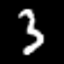
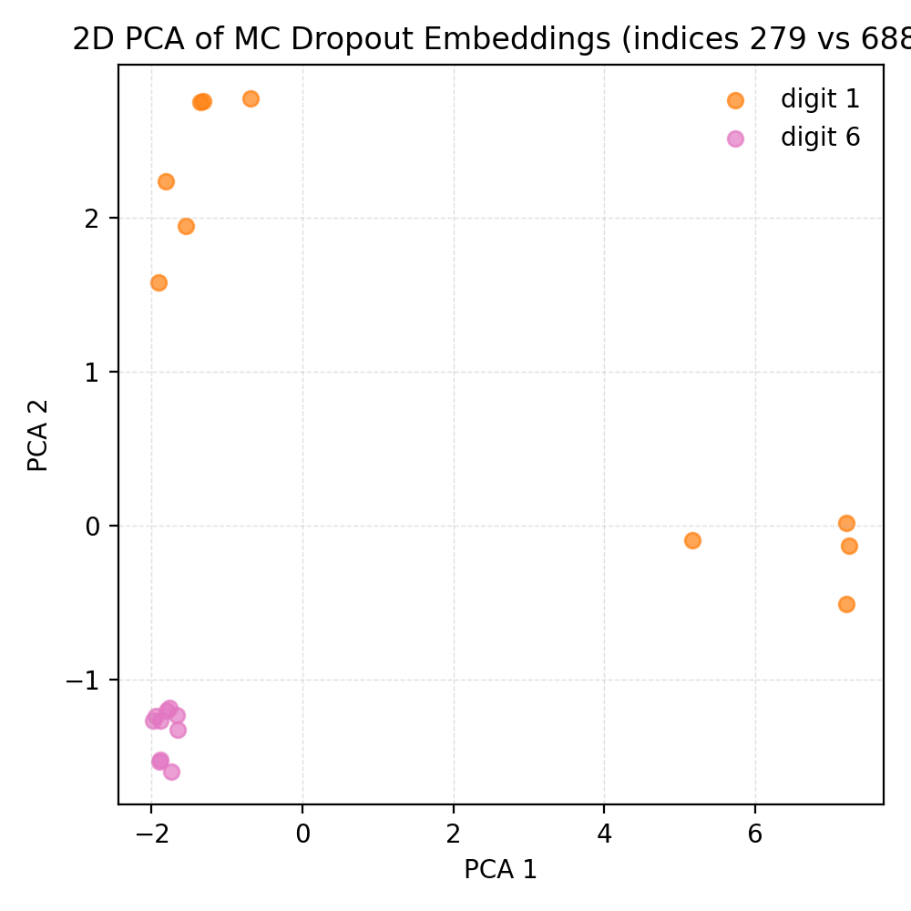

# Monte Carlo Dropout - Encoder-only adapters, p=0.01 (CLIP ViT-B/32 on MNIST)

## 1. Goal & Context
For any input `x`, the uncertainty of the `(model, x)` pair combines two sources:

- **Epistemic (model) uncertainty**
  - Comes from ignorance about parameters due to limited or skewed training data.
  - Dominates off-distribution inputs and sparsely sampled regions.
  - Reducible with more or better data, stronger priors, or extra training.
  - MC dropout signature: different stochastic subnetworks (passes) disagree because each set of sampled weights extrapolates differently.

- **Aleatoric (data) uncertainty**
  - Comes from intrinsic ambiguity or noise in the observation (blurred digits, overlapping strokes).
  - Persists even with infinite data; it is built into the input.
  - Two flavours: homoscedastic (constant per task) and heteroscedastic (input-dependent; MNIST lies here).
  - Irreducible, but can be modelled. When the predictive head is enabled we estimate it via
    H_data = (1/T) * sum_{t=1}^T H(softmax(s^{(t)})):
    the average entropy of each dropout pass. This quantity stays high when every pass makes the
    same diffuse prediction, flagging input-level ambiguity. In this report the predictive head is
    switched off, so we lean on the same intuition with the covariance: directions that maintain
    variance even when all passes agree signal aleatoric effects.

**MC dropout with a fixed input probes epistemic uncertainty. Aleatoric uncertainty requires input variability (e.g., augmentations), then decompose via the law of total variance.**

This run targets three concrete goals:
- Re-run the encoder-only dropout sweep with a much lighter rate (`p = 0.01`) on the MNIST **test** split.
- Keep the sampling protocol fixed (1,000 images, 10 passes, micro-batch 4, deterministic seeds, predictive head enabled) to make results comparable with earlier experiments.
- Quantify how a 10x drop in `p` reshapes embedding variance and shifts uncertainty from epistemic to aleatoric across digits.


## 2. Setup
- **Backbone**: `openai/clip-vit-base-patch32` (vision tower only).
- **Dropout instrumentation**: wrap each transformer block `vision_model.encoder.layers.{0..11}` with `DropoutAdapter(p = 0.01)` while keeping `visual_projection` deterministic.
- **Sampling command**:
  ```bash
  python -m mcdo.mnist_driver \
    --out runs/mnist_encoder_only_dropout_p001_T10_L1000 \
    --limit 1000 --passes 10 --microbatch 4 --save-raw \
    --adapter-drop 0.01 \
    --adapter-target vision_model.encoder.layers.0 \
    ... \
    --adapter-target vision_model.encoder.layers.11
  ```
- **Artifacts**: per-sample tensors (`mu`, `Sigma`), run-level `metrics.csv` and `summary.json`, PCA plots, and an uncertainty digest (`uncertainty_summary.json`).


## 3. Covariance diagnostics primer
- **Trace**: total variance energy across the 512 embedding dimensions (sum of the covariance diagonal). It tells us how wide the cloud is overall.
- **Log determinant (logdet)**: log-volume of the stochastic ellipsoid (sum of log-eigenvalues). Because it adds log-variances, even a small change corresponds to a large multiplicative shift in volume.
- **Off-diagonal mass**: sum of the absolute values of all off-diagonal entries. High values mean many dimensions move together; low values mean mostly independent noise.
- **Aleatoric proxy in covariance form**: When dropout samples align in direction but retain a consistent variance floor, the trace and off-diagonal mass remain elevated even though there is little disagreement. This mirrors the classical `H_data` term in the predictive setting: it is the "part of the spread that persists even when subnetworks agree."
- **Epistemic proxy**: A sudden jump in trace or off-diagonal mass that coincides with the samples fanning out in different directions signals epistemic behaviour-the weights are unsure which way to move.
- This report focuses purely on these embedding statistics. Predictive-head measures (entropy, confidence, mutual information) are omitted so that the discussion stays anchored on encoder dynamics.


## 4. Embedding variance summary (1,000 samples)
| Statistic | p = 0.10 (encoder-only) | p = 0.01 (encoder-only) |
| --- | --- | --- |
| mean(trace) | 31.32 +/- 2.39 | **11.61 +/- 5.45** |
| mean(logdet) | -6942.22 +/- 1.65 | **-6953.86 +/- 2.52** |
| mean(off-diagonal mass) | 4,311 +/- 419 | **1,778 +/- 908** |

How to read these metrics:
- **Trace** sums the diagonal of the covariance. It is the total variance energy across all 512 embedding dimensions; higher trace means wider spread overall.
- **Logdet** is the log determinant of the covariance. It tracks the log-volume of the uncertainty ellipsoid. Because it sums log-eigenvalues, even modest shifts imply large multiplicative changes in volume.
- **Off-diagonal mass** sums the absolute values of all off-diagonal entries. It captures how strongly embedding dimensions move together; high values mean correlated fluctuations, low values mean mostly independent noise.

Key observations:
- Shrinking `p` from 0.10 to 0.01 cuts total variance by ~63% and lowers cross-dimensional coupling by ~2.7x.
- Log-volume tightens by 11.6 units (average log-eigenvalues shrink ~0.023), so the embedding ellipsoid loses ~1e5 of volume.


## 5. Embedding statistics at a glance

| Quantity | Mean | Std |
| --- | --- | --- |
| Trace | 11.61 | 5.45 |
| Logdet | -6953.86 | 2.52 |
| Off-diagonal mass | 1,778 | 908 |

Additional observations:
- Trace and off-diagonal mass move together (Pearson 0.93): wide clouds almost always come with stronger cross-dimensional coupling.
- Logdet varies only a few units, but those shifts correspond to large multiplicative changes in ellipsoid volume because the metric sums log-eigenvalues.
- The long tail of trace (std 5.45) explains why a handful of digits still exhibit noticeable stochastic width even at such a low dropout rate.

Per-digit means:

| Digit | Trace | Off-diagonal |
| --- | --- | --- |
| 0 | 11.85 | 1,832 |
| 1 | 14.15 | 2,078 |
| 2 | 10.04 | 1,557 |
| 3 | 11.21 | 1,754 |
| 4 | 11.82 | 1,839 |
| 5 | 10.52 | 1,640 |
| 6 | 11.39 | 1,685 |
| 7 | 12.02 | 1,848 |
| 8 | 11.27 | 1,780 |
| 9 | 11.28 | 1,697 |


## 6. Digit-level behaviour
- Highest variance: digit **1** (trace mean 14.15), followed by **7** and **0**. The calmest digits are **2** and **5**.
- Off-diagonal mass mirrors trace trends, rising with digits that produce wider clouds (digits 1 and 7 both exceed 1,840).


## 7. 3D PCA snapshot (5 images per digit)


- Clusters are tighter than at `p = 0.10`. Most ellipsoids are small and round; a few digit **1** samples show elongated lobes.
- Digits **4** and **5** overlap, matching their shared misclassification streak.
- The first three PCs explain 56.4%, 18.7%, and 7.5% of variance, so a handful of directions still capture most perturbations.

### 7.1 Focused view: digits 1 vs 7 (4 samples each)


- Digits **1** (orange) occupy a stretched ridge along the first principal axis; their ellipsoids are elongated, illustrating why digit 1 records the highest average trace.
- Digits **7** (gray) sit in a tighter cluster with smaller ellipsoids, matching their lower mean trace (12.02 vs 14.15 for 1s).
- The overlap between the two clusters is limited: the encoder sees them as distinct despite sharing vertical strokes, which helps explain their differing accuracy (1 at 66.7%, 7 at 8%).

| idx 0 (digit 7) | idx 2 (digit 1) | idx 5 (digit 1) | idx 14 (digit 1) |
| --- | --- | --- | --- |
|  |  |  |  |

| idx 17 (digit 7) | idx 26 (digit 7) | idx 29 (digit 1) | idx 34 (digit 7) |
| --- | --- | --- | --- |
|  |  |  |  |

| Index | Digit | Trace | Off-diagonal mass |
| --- | --- | --- | --- |
| 0 | 7 | 12.50 | 1,622.44 |
| 2 | 1 | 8.82 | 1,282.40 |
| 5 | 1 | 17.32 | 2,437.38 |
| 14 | 1 | 7.10 | 1,041.61 |
| 17 | 7 | 4.22 | 627.31 |
| 26 | 7 | 9.77 | 1,135.54 |
| 29 | 1 | 11.38 | 1,757.08 |
| 34 | 7 | 8.99 | 1,152.48 |

### 7.2 Focused view: digits 3 vs 5 (4 samples each)


- Digits **3** (red) and **5** (brown) overlap substantially, reflecting similar handwriting shapes and explaining their matching zero accuracy in this run.
- Ellipsoids for both digits are moderately elongated along the second principal axis, indicating correlated perturbations despite the low dropout rate.
- The mixture of red and brown surfaces within the same region highlights why these digits retain elevated trace and off-diagonal mass-they share latent directions that the encoder finds ambiguous.

| idx 8 (digit 5) | idx 15 (digit 5) | idx 18 (digit 3) | idx 23 (digit 5) |
| --- | --- | --- | --- |
|  |  |  |  |

| idx 30 (digit 3) | idx 32 (digit 3) | idx 44 (digit 3) | idx 45 (digit 5) |
| --- | --- | --- | --- |
|  |  |  |  |

| Index | Digit | Trace | Off-diagonal mass |
| --- | --- | --- | --- |
| 8 | 5 | 17.11 | 2,417.85 |
| 15 | 5 | 3.64 | 506.68 |
| 18 | 3 | 4.82 | 637.96 |
| 23 | 5 | 12.88 | 1,948.72 |
| 30 | 3 | 4.02 | 645.30 |
| 32 | 3 | 20.12 | 3,225.78 |
| 44 | 3 | 9.44 | 1,283.41 |
| 45 | 5 | 4.54 | 584.58 |


## 8. Representative samples
- **Max trace**: index 279 (digit 1) with trace 28.87 and off-diagonal mass 3,798.
- **Min trace**: index 688 (digit 6) with trace 2.90 and off-diagonal mass 392.

| idx 279 (digit 1) | idx 688 (digit 6) |
| --- | --- |
|  |  |

| Index | Digit | Trace | Off-diagonal mass |
| --- | --- | --- | --- |
| 279 | 1 | 28.87 | 3,798 |
| 688 | 6 | 2.90 | 392 |



Ten stochastic embeddings from each sample were projected onto two PCA axes. The digit 1 cloud (orange) spans a wide arc, while the digit 6 cloud (pink) collapses into a tight knot-visual confirmation of the variance gap reported above.


## 9. Recommendations & next steps
1. Increase `--passes` beyond 10 to stabilise covariance estimates at such a low dropout rate.
2. Explore slightly higher encoder dropout (e.g., p = 0.02) or light projection dropout to study how covariance scales without switching on the predictive head.
3. Extend the focused PCA views to other digit pairs (e.g., 0 vs 6) to map which shapes remain most sensitive to dropout perturbations.
