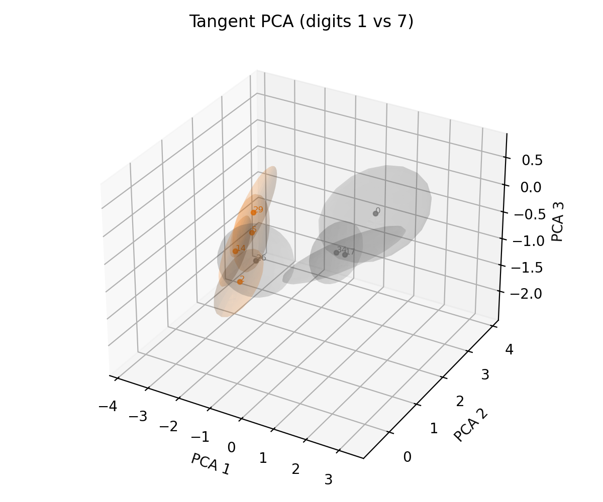

# Geometry-aware MC Dropout Diagnostics - Encoder p=0.01

## 1. Recap vs. new additions
- **Existing analysis (your PDFs):** ambient-space covariance stats (trace/logdet/off-diagonal mass) for MC dropout runs across dropout scopes and rates. Predictive head intentionally disabled; uncertainty reported only at the feature level.
- **New layer in this note:** keep the encoder-only `p = 0.01` run but reinterpret the same embeddings on the geometry they actually live on - the unit 512-sphere. That adds a tangent-space correction, a new scalar (resultant length / circular variance), and sketches how to separate model versus data contributions.

**MC dropout with a fixed input probes epistemic uncertainty. Aleatoric uncertainty requires input variability (e.g., augmentations), then decompose via the law of total variance.**

## 2. Spherical correction (tangent-plane covariance)
- CLIP normalises each embedding, so raw covariance overcounts spread along the radial direction. Projecting onto the tangent plane eliminates that artefact:
  - Projection matrix `P = I - mu_hat mu_hat^T` (with mu_hat = mu / ||mu||)
  - Tangent covariance `Sigma_tan = P Sigma P`
- Summary for the encoder-only `p = 0.01` run (1,000 MNIST test digits, 10 passes):

| Tangent metric | Value |
| --- | --- |
| Mean trace | **8.18** |
| Trace std | **2.96** |
| Mean lambda_max | **3.42** |

- For reference only, the ambient trace was 11.61 (std 5.45); the tangent projection trims ~30% of the energy and collapses the dominant eigenvalue by ~75%.

## 3. Circular statistics (single scalar of dispersion)
- Treat each dropout embedding as a point on the sphere; the **resultant length** `R = |(1/T)sum z^{(t)}|` summarises how tightly they cluster. The complementary **circular variance** is `V_circ = 1 - R`.
- For the run:
  - `R_mean = 0.957 +/- 0.024` (1.0 means perfect agreement).
  - `V_circ = 0.043 +/- 0.024` - a compact, unitless uncertainty scalar you can quote per image.

Resultant length tends to drop whenever tangent trace grows:

## 4. Sample call-outs (images + numbers)
- The eight samples previously used in the ambient report are revisited here with tangent-only metrics. Larger tangent trace -> more elongated ellipsoid -> lower resultant length.

| Index | Digit | Tangent trace | lambda_max(tan) | `V_circ` |
| --- | --- | --- | --- | --- |
| 318 | 9 | **21.40** | 13.68 | 0.140 |
| 640 | 0 | **18.71** | 7.45 | 0.130 |
| 200 | 6 | **17.80** | 7.03 | 0.129 |
| 279 | 1 | **17.02** | 6.65 | 0.118 |
| 945 | 2 | **18.33** | 9.36 | 0.110 |

| Index | Digit | Tangent trace | Off-diag (tan) |
| --- | --- | --- | --- |
| 0 | 7 | 8.26 | 1,138 |
| 2 | 1 | 6.18 | 863 |
| 5 | 1 | 12.82 | 1,882 |
| 14 | 1 | 5.33 | 676 |
| 17 | 7 | 3.61 | 431 |
| 26 | 7 | 7.17 | 889 |
| 29 | 1 | 8.83 | 1,325 |
| 34 | 7 | 6.80 | 888 |

| idx 318 (digit 2) | idx 640 (digit 1) | idx 200 (digit 3) | idx 279 (digit 1) | idx 945 (digit 2) |
| --- | --- | --- | --- | --- |
|  |  |  |  |  |

### 4.1 Tangent-space PCA views
- **All digits (tangent covariances):** 
  - Ellipsoids shrink noticeably compared to the ambient plot; the projection removes radial artefacts.
- **Digits 1 vs 7 (tangent):**

  

| idx 0 (digit 7) | idx 2 (digit 1) | idx 5 (digit 1) | idx 14 (digit 1) |
| --- | --- | --- | --- |
|  |  |  |  |

| idx 17 (digit 7) | idx 26 (digit 7) | idx 29 (digit 1) | idx 34 (digit 7) |
| --- | --- | --- | --- |
|  |  |  |  |

| Index | Digit | Tangent trace | lambda_max(tan) | `V_circ` |
| --- | --- | --- | --- | --- |
| 0 | 7 | 8.14 | 3.02 | 0.046 |
| 2 | 1 | 7.90 | 3.39 | 0.028 |
| 5 | 1 | 13.12 | 4.39 | 0.065 |
| 14 | 1 | 5.82 | 2.30 | 0.021 |
| 17 | 7 | 4.19 | 1.27 | 0.013 |
| 26 | 7 | 6.67 | 1.74 | 0.029 |
| 29 | 1 | 8.98 | 3.72 | 0.039 |
| 34 | 7 | 5.38 | 2.00 | 0.030 |

- **Digits 3 vs 5 (tangent):**

  

| idx 8 (digit 5) | idx 15 (digit 5) | idx 18 (digit 3) | idx 23 (digit 5) |
| --- | --- | --- | --- |
|  |  |  |  |

| idx 30 (digit 3) | idx 32 (digit 3) | idx 44 (digit 3) | idx 45 (digit 5) |
| --- | --- | --- | --- |
|  |  |  |  |

| Index | Digit | Tangent trace | lambda_max(tan) | `V_circ` |
| --- | --- | --- | --- | --- |
| 8 | 5 | 10.92 | 4.19 | 0.062 |
| 15 | 5 | 3.34 | 1.04 | 0.011 |
| 18 | 3 | 4.77 | 1.31 | 0.015 |
| 23 | 5 | 9.35 | 3.98 | 0.045 |
| 30 | 3 | 3.98 | 1.74 | 0.013 |
| 32 | 3 | 12.43 | 5.66 | 0.082 |
| 44 | 3 | 6.22 | 2.07 | 0.031 |
| 45 | 5 | 4.50 | 1.13 | 0.015 |

## 5. Visual intuition: max vs min trace
- Index **279** (digit 1) saturates the tangent trace budget; index **688** (digit 6) barely moves.

| idx 279 | idx 688 |
| --- | --- |
|  |  |

## 6. Towards epistemic vs aleatoric decomposition
The tangent stats give you one knob; splitting them now requires a second knob (`a`) that injects data noise:

1. **Epistemic**: keep `a = a0` (no augmentation) and run dropout -> `Sigma_epi = Cov_omega[z(x, omega, a0)]_tan`.
2. **Aleatoric**: draw augmentations `a` (blur/occlusion/jitter you care about) and average `Sigma_ale = E_omega[Cov_a(z(x, omega, a))_tan]`.
3. **Total** ~ `Sigma_epi + Sigma_ale`.

Implementation hook: `mcdo.geometry_analysis` already streams per-sample covariances. Extend it by looping over your augmentation(s) and averaging in-place.

## 7. Operational tweaks from the delta list
- **Higher T at low p:** the grid already flagged `T=16` as noisy for `p = 0.01`; push to `T >= 50` and apply shrinkage before logdet.
- **Source localisation:** you already toggle projection vs no projection; if you later resurrect the text tower, run image-only vs text-only dropout to identify which half contributes.
- **OOD probes:** feed rotated/blurred digits as a separate slice. Expect tangent trace to rise primarily through the epistemic term (if you add the augmentation channel above).

## 8. Quick-start tooling
- `python -m mcdo.geometry_analysis runs/mnist_encoder_only_dropout_p001_T10_L1000 --out reports/mnist_mcdo/geometry_summary_p001.json`
  - Produces per-sample tangent stats plus dataset summary.
- `scripts/3dpca.sh`
  - Option 1/2/3 now open interactive Plotly PCA views with hover-inlined MNIST thumbnails.

## 9. Next steps
1. Regenerate the p-grid with tangent trace + circular variance alongside ambient stats (easy drop-in to existing pipeline).
2. Capture augmentation sweeps to factorise uncertainty (`Sigma = Sigma_epi + Sigma_ale`).
3. Deploy the interactive PCA for QA: hover gives index, digit, trace, off-diagonal mass, and the raw glyph in one shot.

Medical References:
1. None - DOI: file_0000000039e861f58124243e82d1d6c1
2. None - DOI: file_0000000064d4622f9638923d89c66152
3. None - DOI: file_0000000009a0622f815203e122d812da
